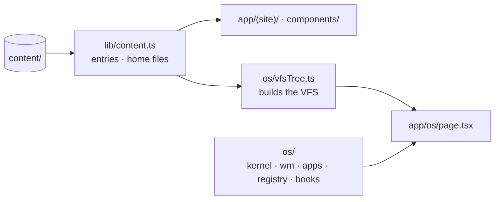
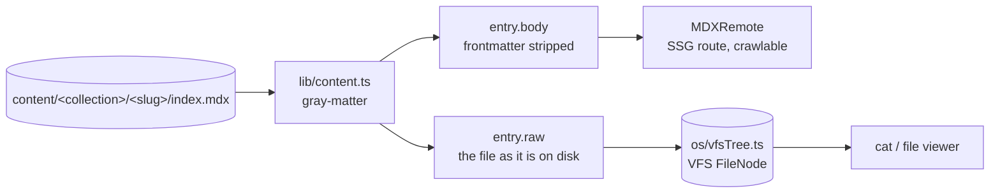

# Architecture (as built)

What the site's code does right now. It is the companion to
[design.md](design.md), which holds the intent. Where the two disagree, this
file is right and the design doc needs a patch.

**Status, 2026-09-27:** the site is a set of server-rendered pages built from
`content/` — a home page listing the work, `/about`, and a listing and detail
route per collection. It is being rebuilt around a knowledge graph of the work
([plan](plans/2026-09-27-graph-home.md)); nothing of the graph exists yet. The
OS that used to be the site's framing is now a separate, frozen project in
`os/`, documented in [os/architecture.md](os/architecture.md).

---

## Structure: the site and the OS

```
app/
  (site)/          the site's routes and chrome
  os/page.tsx      /os — a route only; everything behind it lives in os/
  layout.tsx sitemap.ts robots.ts
components/        entry.tsx (article, listing), mdx.tsx (typography)
lib/               content.ts (the pipeline), memo.ts, site.ts
os/                the OS: kernel/ wm/ apps/ registry/ hooks/, OsShell.tsx, vfsTree.ts
content/           the source of truth for both
```



**The dependency runs one way** ([D-037](decisions.md)). The OS reads content
through `lib/content.ts`, exactly as the site's routes do. Nothing outside `os/`
and `app/os/` imports the OS, and the OS imports from the site only
`lib/content`, `lib/memo` and `components/mdx` — the last for the viewer's prose
styling ([D-018](decisions.md)). `lib/boundary.test.ts` asserts both directions
by reading every source file's imports; a violation fails `pnpm test` with the
offending file and specifier.

The OS is **frozen, not archived**: its 463 unit tests still run in
`pnpm test` and its browser checks still pass, so a site change that breaks it
fails loudly. Its open work is [os/backlog.md](os/backlog.md).

---

## Content pipeline

`lib/content.ts` is the only module that knows how content is laid out on disk.
It is server-only by construction — it reads with `node:fs`, so it cannot reach
a client bundle without failing the build.

Directory per entry, so a writeup can carry assets:

```
content/
  home/whoami.md                      → /about, and `whoami` in the OS
  home/about.md · readme.md · now.md  → the OS's /home
  projects/<slug>/index.mdx           → /projects/<slug>
  papers/<slug>/index.mdx             → /papers/<slug>
  presentations/<slug>/index.mdx      → /presentations/<slug>
  <collection>/<slug>/figure.png      → mirrored to /public by the prebuild step
```

**Tested on fixtures.** `lib/content.ts` computes its directory from
`process.cwd()` at import — which also keeps Turbopack's file tracing scoped to
`content/`. Tests that check how the pipeline *behaves* load a second copy of
the module with `cwd` pointed at `lib/__fixtures__/`, whose `content/` holds
exactly one published entry and one draft, so draft behaviour is tested
whatever real content happens to hold ([D-038](decisions.md)).

Frontmatter: `title`, `summary`, `date` (all required — a missing one throws
with the file path rather than shipping a blank `<title>`), plus optional `tags`
and `draft`. Other fields are kept in the file but not read.

One read on disk serves every consumer, which is the whole point of
[D-010](decisions.md):



`raw` keeps the frontmatter because that is what is actually in the file, and
what the OS's `cat` prints. `body` is what MDXRemote compiles.

**Drafts are asymmetric on purpose.** `draft: true` removes an entry from
`listEntries`, from the listing pages, from the sitemap and from
`generateStaticParams` — so it is never built and never crawled. It stays in
`allEntries`, so the OS still shows it.

| Surface | Sees drafts? |
|---|---|
| `/papers` listing, `/papers/<slug>` route, sitemap | no — 404 |
| the OS | yes |

**Loose files.** `content/home/` is not a collection. `getHomeFile(name)` reads
one file for a route — `/about` renders `whoami.md`, the same bytes the OS's
`whoami` prints ([D-036](decisions.md)). `listHomeFiles()` lists them all with
the URL of their mirrored copy; the OS mounts every one at `/home`.

---

## Routes

`app/(site)/` holds the site with its own chrome — header, nav, footer, and a
`max-w-3xl` reading width. `/os` sits outside that route group because it is
full-viewport and brings its own.

| Route | Renders |
|---|---|
| `/` | name, a short introduction, and the three collections through `EntryList` |
| `/about` | `HomeArticle` over `content/home/whoami.md` |
| `/projects` · `/papers` · `/presentations` | `EntryList` for the collection |
| `/<collection>/<slug>` | `EntryArticle` — `generateStaticParams` from `listEntries`, `generateMetadata` from frontmatter, `notFound()` otherwise |
| `/os` | the OS ([os/architecture.md](os/architecture.md)) |

Every route is static. `components/mdx.tsx` holds the typographic component
map, and is the seam where a writeup's own React components get registered;
its anchor renders internal links through `next/link`.

## Metadata

`lib/site.ts` holds the canonical URL, name and description; the root layout
sets `metadataBase` and the title template from it, and `app/sitemap.ts` and
`app/robots.ts` read the same constant. The sitemap is built from
`listAllPublished()`, so a draft cannot leak into it and a published entry
cannot be left out.

## Tests

`pnpm test` runs everything under `lib/` and `os/` in bare node — no jsdom, no
browser. For the site: the content pipeline against fixtures and against real
content (`lib/content.test.ts`), and the OS boundary (`lib/boundary.test.ts`).
`pnpm verify:content` checks in real Chrome that a published entry renders with
JavaScript disabled and that the OS reads the same bytes.

---

## Known gaps

- **The home page is a list, not the graph.** That is the work in progress.
- **The chrome still frames the site as an OS.** The header name
  `personal-os`, the `/os` nav item, the home page's `boot →` button, its
  "This site is a mock operating system" paragraph, and the footer line.
- **Every visible link to `/os` prefetches the whole OS in production.** `/os`
  is static, so `<Link>` fetches the full route and its data — the entire VFS
  tree ([D-011](decisions.md)) — as soon as a link to it scrolls into view. The
  header, footer and `boot →` link do that on every page today.
- **Published summaries are placeholders.** All seven published entries still
  read `DRAFT — replace this.`
- **No phone layout and no accessibility work** beyond what plain
  server-rendered HTML gives for free.
