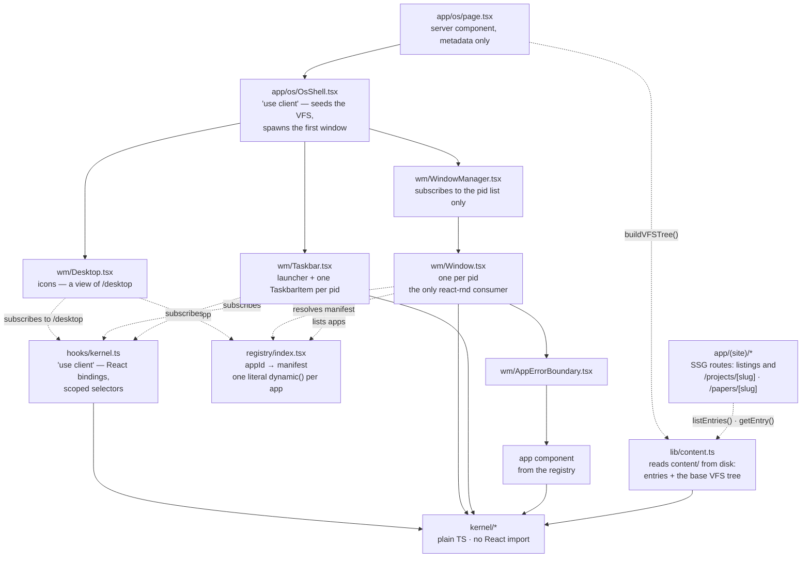
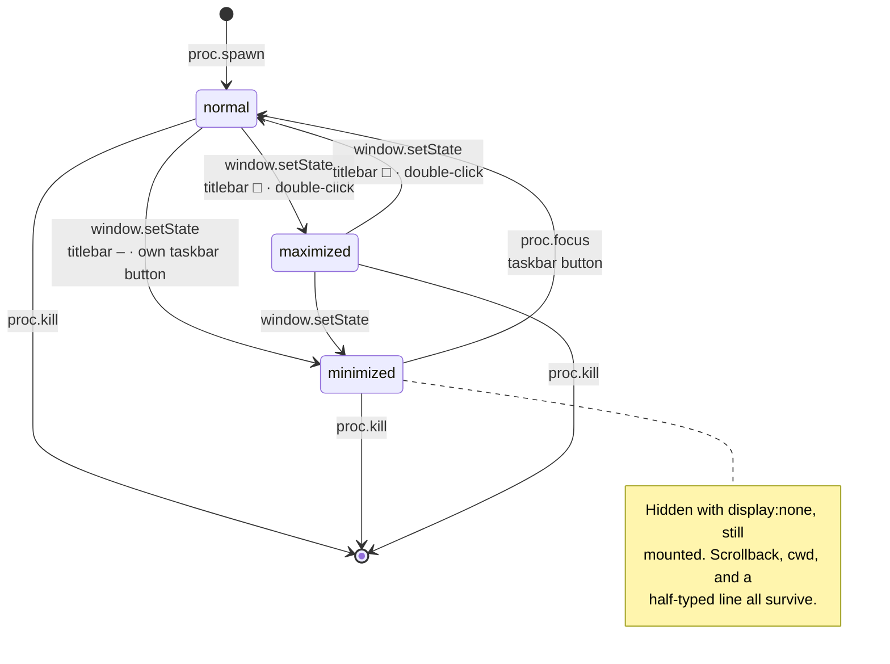
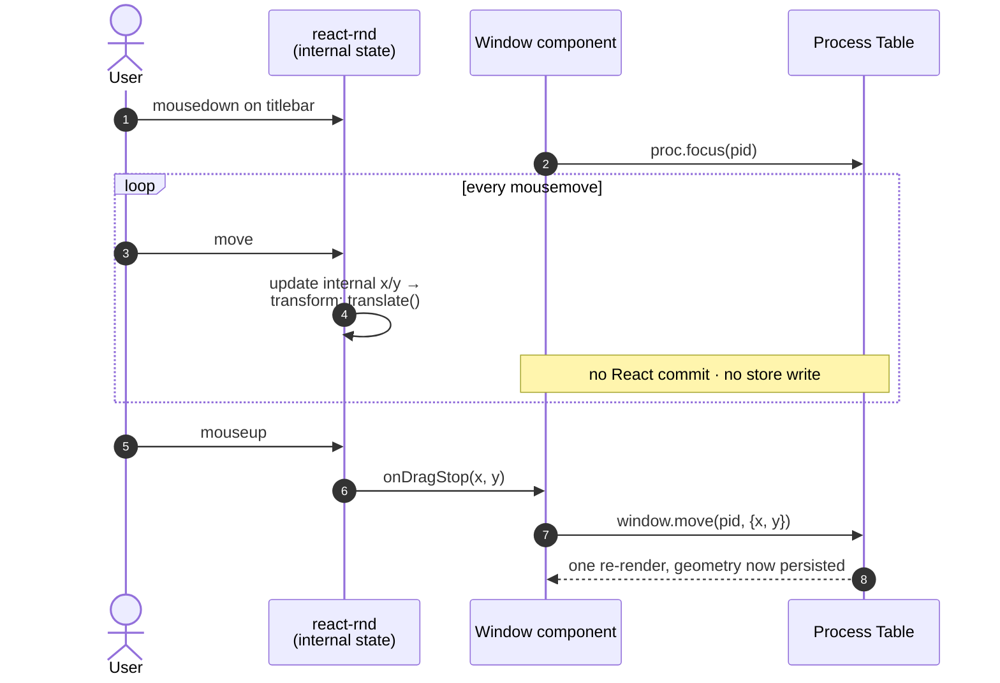
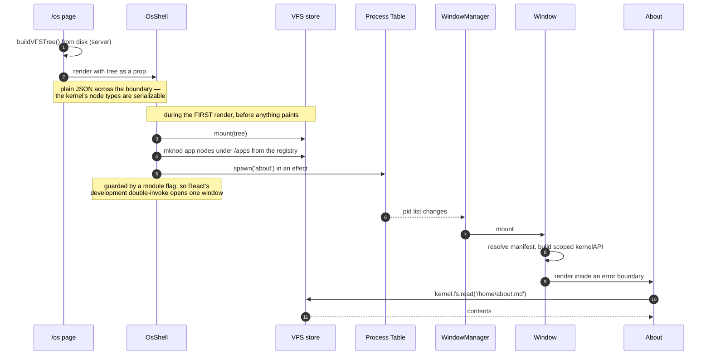
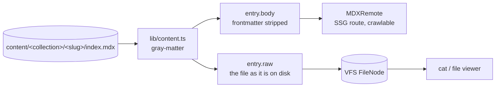
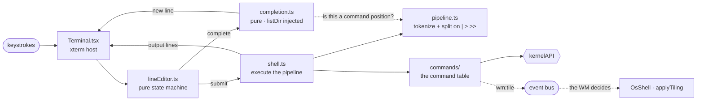
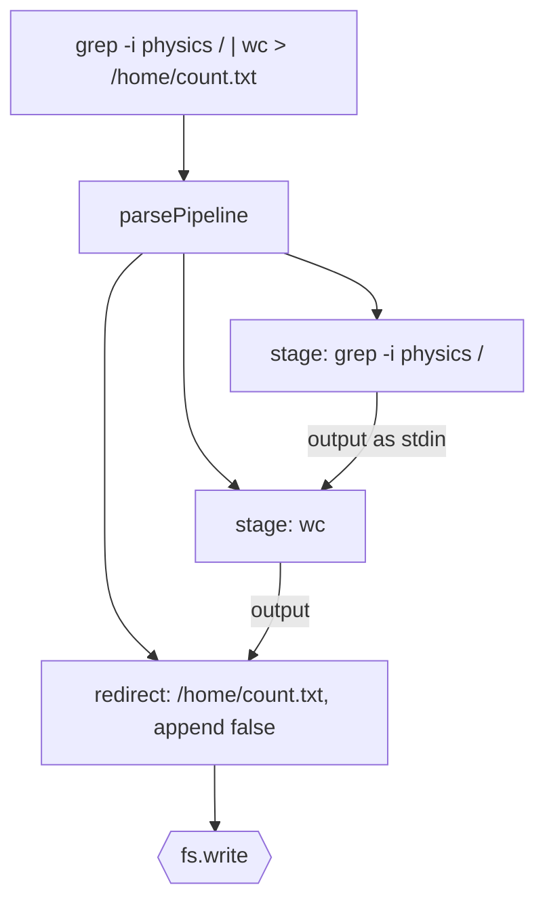
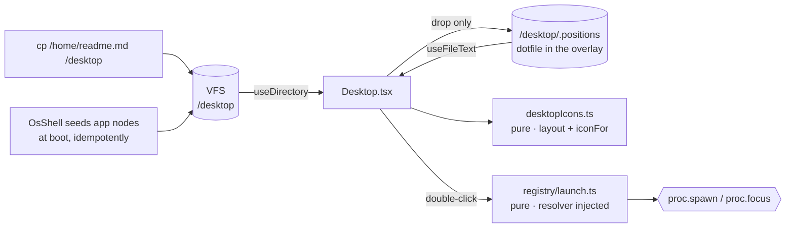
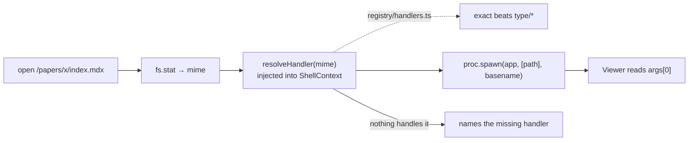

# Architecture (as built)

What the code actually does, as of commit `7d53389`.

This is the companion to [personal-os-portfolio.md](personal-os-portfolio.md):
that file is the design and the intent, this one tracks the implementation and
is updated whenever the implementation moves. Where they disagree, this file is
right and the design doc needs a patch.

**Status:** design doc Phases 1 and 2 complete. Kernel, syscall boundary,
registry, window manager with snapping and tiling, crawlable SSG content,
shell with pipelines, completion and persisted history, file viewer, file
manager, text editor, settings, a desktop with icons, right-click menus and a
wallpaper, wired persistence. No game yet.

---

## 1. Layer map



The dependency rule, and the one worth enforcing in review: **`kernel/` imports
nothing from `apps/`, `wm/`, `registry/`, or `hooks/`.** Every arrow above
points *into* it and none point out. It does not know what an app is, only that
something asked to spawn a process or read a path.

### When a layer needs something it is not allowed to have

This comes up repeatedly, and the answer has been the same every time, so it is
worth stating once rather than re-deciding.

A module knows *what* should happen but lacks what it needs to *make* it
happen. The instinct is to hand it the capability. That always works, and it
always costs the property that made the module worth having:

| Module | Wants to | Would need | Would cost |
|---|---|---|---|
| `lineEditor.ts` | complete a path on Tab | the VFS | every keystroke test would have to seed a filesystem |
| `commands/` | tile the windows | the DOM and the WM | commands stop running in node; an app could move any window |
| `Window.tsx` | preview a snap mid-drag | React state | a commit inside the mousemove loop ([D-002](decisions.md)) |

**Pass a message instead of acquiring the capability.** The module says what it
wants; something that already has the right context does it.

Two mechanisms, and they are not interchangeable:

| | **Effect** — a return value | **Event** — the bus |
|---|---|---|
| Means | "Caller, do this and give me the answer" | "Whoever cares, here is what I want" |
| Responder | the immediate caller, always | anyone subscribed, possibly nobody |
| Answer returns? | yes, directly | no |
| Coupling | requester knows someone will handle it | requester knows nothing about the handler |
| Example | Tab → `{ type: 'complete' }` ([D-022](decisions.md)) | `tile` → `wm:tile` ([D-023](decisions.md)) |

Pick the **effect** when the requester needs the result back and the caller is
the obvious owner — completion has to return the completed string. Pick the
**event** when the requester needs nothing back and the handler is a distant
part of the system it should not hold a reference to — the shell should not be
able to reach the window manager at all.

The payoff is concrete and measurable: **472 unit tests run in bare node in
well under a second** — no jsdom, no browser, no component harness. That holds
only because the line editor has no filesystem and the command table has no DOM,
and it stops holding the first time either is handed a capability "just for this
one feature."

---

## 2. Kernel

Three stores plus an API layer. All of `kernel/` is plain TypeScript using
`zustand/vanilla` — see [D-001](decisions.md).

### `kernel/vfs.ts`

```ts
type VFSNode = DirNode | FileNode | AppNode

DirNode   { type: 'dir',  name, children: Record<string, VFSNode>, meta? }
FileNode  { type: 'file', name, mime, content?: string, src?: string, meta? }
AppNode   { type: 'app',  name, appId, meta? }
```

`src` lets a large asset (a PDF) live in `/public` and stay out of the
serialized tree. `AppNode` makes launchables visible to the filesystem, so a
future shell gets `ls /apps` and `open /apps/about` without new machinery.

Pure path helpers, deliberately separate from the store so the shell can use
them and so they test without React: `normalize`, `join`, `resolvePath`,
`dirname`, `basename`, `resolve(root, path)`.

Two behaviours worth knowing:

- `normalize` treats `..` above the root as a no-op, as POSIX does, but
  preserves leading `..` on relative paths (which have no known root).
- `resolve` returns `null` rather than a node when the walk would descend
  *through* a file — `/notes.md/child` is not a path.

Writes copy only the spine of the tree (`setNode`), so untouched subtrees keep
their object identity. That is what makes selector-scoping possible at all — and
it is also why `baseRoot` is nearly free: the tree as mounted stays intact
rather than needing a copy.

**The filesystem is writable**, with one rule: you can only remove what you
added ([D-027](decisions.md)). `unlink` deletes an overlay-created node, reverts
an *edited* published node to its published version, and refuses an untouched
one. That is what makes deletion survive a reload without tombstones — the base
tree is rebuilt from `content/` every load, so a file that only ever lived in
the overlay simply never returns.

### `kernel/process.ts`

```ts
Process {
  pid, appId, args, title,
  position: { x, y },
  size: { width, height },
  zIndex,
  state: 'normal' | 'minimized' | 'maximized'
}
```

Store also holds `focusedPid`, `nextPid`, `nextZIndex`. Focus and z-index are
owned centrally here, never per-window — design doc §2 warns that splitting them
is how z-index bugs appear.

**The load-bearing invariant:** every mutator leaves *untouched* process objects
referentially identical. `move`, `resize`, `focus`, and `setWindowState` rebuild
only the entry they change. Break this and every window re-renders on every
drag. Tested directly in `process.test.ts`.

Focus behaviour: `focus()` on a minimized window restores it; killing or
minimizing the focused window hands focus to the topmost survivor, not to
nothing; focusing the window already on top is a no-op that doesn't touch state.



Minimizing used to `return null`, which unmounted the app and destroyed its
state. [D-013](decisions.md) changed that: the frame stays mounted and is hidden
with `display: none`. The cost is memory rather than frame time, and it is what
makes a terminal survivable across a minimize.

### `kernel/events.ts`

`EventBus` over `Map<string, Set<handler>>`. `on()` returns its own unsubscribe
rather than exposing `off()` — `docs/gotchas.md` names uncleaned listeners as
the leak that kills a long-lived session, so the API hands you the cleanup you
need. `emit` iterates a copy, so a handler may unsubscribe mid-emit.

Currently emitted:

| Event | Payload | Emitted by | Handled by |
|---|---|---|---|
| `fs:changed` | `{ path, appId }` | every `fs.write` | apps that care about a file |
| `wm:tile` | `{ mode }` | the shell's `tile` command | `OsShell`, which arranges the windows |

`wm:tile` is the bus doing what design doc §2 described: an app announces intent
and the window manager decides, rather than the app reaching into the WM
([D-023](decisions.md)). The shell's `tile` command cannot move a window and
does not know how big the desktop is.

### `kernel/api.ts` — the syscall boundary

`createKernelAPI(app: AppIdentity)` returns a handle closed over that app's
manifest. Every method calls `assertPermission` first.

```ts
fs.read(path)            → string | null   // file contents, not the node
fs.write(path, data)     → void            // also emits fs:changed
fs.list(path)            → VFSNode[]
fs.stat(path)            → VFSNode | null  // metadata: mime, src, appId

proc.spawn(appId, args?, title?) → number
proc.kill(pid)           → void
proc.focus(pid)          → void
proc.list()              → Process[]   // snapshot ordered by pid; backs `ps`

window.move(pid, pos)              → void
window.resize(pid, dims, pos?)     → void   // pos when a top/left handle moved the origin
window.setState(pid, windowState)  → void

events.emit(name, payload)  → void
events.on(name, handler)    → Unsubscribe
```

Permissions: `fs.read` `fs.write` `proc.spawn` `proc.kill` `proc.focus`
`proc.list` `window.manage` `events.emit` `events.listen`.

`systemAPI` is a handle with all permissions, used by the WM and taskbar — they
are policy layers of the system, not apps running on top of it, but they still
go through the boundary rather than touching stores.

Deviations from the doc's §3 sketch, all additive:

| Doc §3 | As built | Why |
|---|---|---|
| `fs.read(path)` returns a node | returns file text; `fs.stat` returns the node | §8.2 uses `fs.read('/…/README.md')` as content |
| `proc.spawn(appId, args)` | `+ title?` | so the launcher can label an instance without the kernel knowing app names |
| `window: { resize, move }` | `+ setState` | minimize/maximize needed a path through the boundary |
| manifest holds `permissions` | split: kernel sees `AppIdentity { id, permissions }`, registry adds `name/icon/component` | keeps React types out of `kernel/` |

### `kernel/persistence.ts`

**Wired as of Phase 2** ([D-019](decisions.md)). `startAutosave` subscribes to
both stores, debounces 400ms, and flushes on `pagehide` — a debounce without
that loses exactly the work a closing tab most needs saved. `OsShell` loads
before starting it, and only spawns the default terminal when no session was
restored.

`SCHEMA_VERSION = 1`, a `migrations` map keyed by the version being migrated
*from*, and `migrate(raw)` that returns `null` — never throws — for junk, a
missing migration step, or a blob written by a newer build. Null means "start
fresh"; a returning visitor should never see a crash.

`snapshot()` / `hydrate()` move state in and out of `PersistedState`:

```ts
{ schemaVersion, overlay: Record<path, content>, session: { processes, focusedPid, nextPid, nextZIndex } }
```

The base tree is **not** in the blob — see [D-003](decisions.md).
`createLocalStorageAdapter` and `createMemoryAdapter` implement `StorageAdapter`.

**Not wired.** Nothing auto-saves yet. Phase 2.

---

## 3. Render topology

Who re-renders when, which is the whole performance story:

| Event | Re-renders |
|---|---|
| Window dragged (during) | **nothing** — react-draggable's internal state only |
| Window dragged (on release) | that one `Window` |
| Window resized (on release) | that one `Window` |
| Focus changes | the two `Window`s + two `TaskbarItem`s whose focus flipped |
| Window opens / closes | `WindowManager`, `Taskbar`, and the new/removed `Window` |
| Window minimized / maximized | that `Window` + its `TaskbarItem` |
| File written | only components subscribed to that path |

`WindowManager` subscribes to `usePids()` (shallow-compared array), so it holds
still through every drag, resize, and focus change. See [D-006](decisions.md).

### The drag lifecycle

The single most important sequence in the codebase. Geometry has two owners
depending on whether a gesture is in flight:



The loop is the part to protect. `position`/`size` are passed to react-rnd as
*controlled* props, but react-draggable renders from its own internal state
while `dragging` is true and ignores the prop until the pointer lifts
(`Draggable.js:862`) — so passing controlled props costs nothing as long as
nothing writes them mid-gesture. Committing in `onDrag` instead of `onDragStop`
would put a store write inside that loop and re-render on every mousemove.

`Window.tsx` logs `[wm] pid N commit #M` on every commit in development, so this
is observable rather than assumed; `pnpm verify` asserts it.

---

## 4. App contract

An app is a default-exported component receiving:

```ts
{ pid: number, args: string[], kernel: KernelAPI }
```

The `kernel` handle is built from its manifest, so its permissions are baked in
and cannot be widened at the call site. Apps import nothing from `kernel/`
except types.

Adding one:

1. `apps/<name>/<Name>.tsx`, default export, typed `AppProps`
2. add a manifest to `registry/index.tsx` with a **literal** `dynamic()` import
   ([D-005](decisions.md))
3. optionally an `AppNode` in `content/index.ts` so it appears under `/apps`

No kernel change. That is the property design doc §3 is protecting.

Current apps, both deliberately thin:

- **`about`** — `['fs.read']`. Reads `/home/about.md` through the boundary
  rather than importing it, so the app→VFS path is proven. Has a "crash this
  app" button that throws during render, to demonstrate containment.
- **`sysinfo`** — `['fs.read', 'events.listen']`. Live kernel state; also exists
  so per-app code splitting is observable in the network tab.

---

## 5. Boot sequence



Mounting during the first render rather than in an effect is deliberate: the VFS
is populated before anything paints, so no window ever renders against an empty
filesystem.

`/apps` is registered client-side because the registry holds React components
and is necessarily a client module — the server loader builds only what it can
read off disk.

---

## 6. Content pipeline

`lib/content.ts` is the only module that knows how content is laid out on disk.
It is server-only by construction — it reads with `node:fs`, so it cannot reach
a client bundle without failing the build.

Directory per entry, so a writeup can carry assets:

```
content/
  home/about.md                       → /home/about.md          (inline)
  home/whoami.md                      → /home/whoami.md         (inline)
  home/now.md                         → /home/now.md            (inline)
  projects/<slug>/index.mdx           → /projects/<slug>/index.mdx
  papers/<slug>/index.mdx             → /papers/<slug>/index.mdx
  papers/<slug>/figure.txt            → FileNode with src, mirrored to /public
```

Anything dropped into `content/home/` appears in the VFS without code changes —
`buildHomeDir()` walks the directory rather than naming files. `getHomeFile()`
is the other half: it reads one such file for a server route, so `/about` and
the shell's `whoami` render the same bytes ([D-036](decisions.md)).

Frontmatter: `title`, `summary`, `date` (all required — a missing one throws
with the file path rather than shipping a blank `<title>`), plus optional `tags`
and `draft`.

One read on disk serves two consumers, which is the whole point of
[D-010](decisions.md):



`raw` keeps the frontmatter because that is what is actually in the file, and
what `cat` should print. `body` is what MDXRemote compiles.

**Drafts are asymmetric on purpose.** `draft: true` removes an entry from
`listEntries`, from the listing pages, and from `generateStaticParams` — so it
is never built and never crawled. It stays in the VFS, so work in progress is
still openable inside the OS. `pnpm verify:content` asserts both halves.

| Surface | Sees drafts? |
|---|---|
| `/papers` listing, `/papers/<slug>` route | no — 404 |
| VFS, and therefore the OS | yes |

**Routes.** `app/(site)/` holds the crawlable half with its own chrome; `/os`
sits outside that route group because it is full-viewport and brings its own.
Each detail route is a thin wrapper over `EntryArticle` — `generateStaticParams`
from `listEntries`, `generateMetadata` from frontmatter, `notFound()` otherwise.
`/about` is the exception: it renders `HomeArticle` over a single
`content/home` file rather than a collection entry, so it has no slug, no
listing and no `draft` flag. `components/mdx.tsx` holds the typographic
component map, and is the seam where a writeup's own React components get
registered.

**Metadata.** `lib/site.ts` holds the canonical URL, name and description; the
root layout sets `metadataBase` and the title template from it, and
`app/sitemap.ts` and `app/robots.ts` read the same constant. The sitemap is
built from `listAllPublished()`, so a draft cannot leak into it and a published
entry cannot be left out.

## 7. The shell

The terminal is the first app with structure worth describing, and the structure
is the same idea as the kernel: **the shell does not know xterm exists.**



`lineEditor.ts`, `pipeline.ts` and `shell.ts` are plain TypeScript — no xterm,
no React, no DOM. xterm is one possible *device* attached to the shell. That is
what lets all of it be tested in a bare node environment; the terminal's browser
checks only have to prove the wiring, not the logic.

| File | Knows about |
|---|---|
| `Terminal.tsx` | xterm, the DOM, and nothing else worth testing |
| `lineEditor.ts` | buffer, cursor, history. Pure `(state, input) => [state, effects]` |
| `pipeline.ts` | a line of text, and what `\|`, `>` and `>>` mean in one |
| `shell.ts` | running the stages; formats `CommandError` into a line |
| `commands/` | the syscall boundary and a cwd |
| `completion.ts` | a token, a cwd, and an injected `listDir` |
| `render.ts` | a buffer, a cursor, and a column count |

**cwd is app state**, held per terminal instance, not in the kernel — design doc
§8.4 puts app-internal state in the app. Two terminals have two working
directories, which is the point of opening a second one.

Path handling reuses `resolvePath`/`resolve` from `kernel/vfs.ts` rather than
reimplementing it, so `cd ..` and the VFS agree by construction.

The terminal reacts to its **own box** via a `ResizeObserver` rather than
subscribing to the process table, so the WM stays unaware it exists. The
observer is rAF-debounced because a resize gesture fires it continuously, and it
skips `fit()` at 0×0 — which is exactly what a minimized window is under
[D-013](decisions.md).

**History is a file**, `/home/.history` ([D-020](decisions.md)) — read on spawn,
appended on commit through `fs.write`, batched at 250ms and flushed on
`pagehide`. It rides the write overlay rather than adding a store, and
`cat /home/.history` works. `ls` hides dotfiles unless given `-a`.

The terminal is therefore the first app holding `fs.write`.

The command table is a directory ([D-024](decisions.md)) grouped by what each
command touches — `fs.ts`, `proc.ts`, `system.ts`, `write.ts` — with `types.ts`
for the shared shape and `walk.ts` for the recursive tree walk that `grep`,
`find`, `tags`, and `tree` share. Thirty-one commands.

Each carries its own `description` and `examples`, which `man` prints. A test
asserts every command has them, so one cannot ship undocumented.

The search commands exist because content nodes carry their frontmatter in
`meta` and nothing read it: `stat` shows it, `tags` indexes it, `grep` and
`find` make the tree searchable rather than merely walkable.

**Tab completion** ([D-022](decisions.md)) is another pure module,
`completion.ts`, with directory listing injected as a function. The line editor
maps Tab to a `complete` effect rather than doing the work — it has no
filesystem and should not grow one. Extending to the longest common prefix and
listing only when that adds nothing reproduces bash's two-tap behaviour with no
extra state. It completes a command name at the start of a line and after each
unquoted `|`, and a path everywhere else.

**Pipelines and redirection** ([D-029](decisions.md)) split across the two:



`pipeline.ts` is the parser and is where the bugs in a feature like this live,
so it is a module with its own tests rather than a branch inside `runCommand`.
It owns `tokenize`, the split on `|` / `>` / `>>`, and
`findUnsupportedOperator` — the rejection list for `<`, `2>`, `&&` and `||`,
which are still not implemented and say so by name. `shell.ts` is what happens
after: run each stage with the previous stage's output as its `stdin`, then
either return the last stage's lines or write them to a file.

Three rules carry the behaviour, all in [D-029](decisions.md): **a command reads
stdin only when it was given no path**, so no flag is needed; **only the final
stage's `cwd`, `clear` and `reset` count**, since the earlier ones are producing
text; and **a trailing newline terminates the last line rather than beginning an
empty one** (`toLines`), so what a redirect wrote reads back as what the
pipeline produced.

This works at all because commands *return* `string[]` rather than printing —
a property they have for testability, which turned out to be exactly the shape a
pipeline needs.

`render.ts` builds the repaint sequence and is pure — walking up over a wrapped
line, erasing to end of *display*, and placing the cursor absolutely. The
previous version cleared only the current row, which duplicated the prompt
whenever an edited line wrapped.

Not implemented, deliberately: `<`, `2>`, `&&`, `||`, `$( )`, globs, variables,
job control, and exit codes. Design doc §2 calls shell syntax a scope-creep
magnet and is right about where the magnet is — each of these would be its own
decision ([D-029](decisions.md)).

## 8. The desktop

The icon surface under the windows, and the newest of the three things `OsShell`
renders. **It is a view of `/desktop`, a real directory in the VFS**
([D-030](decisions.md)) — there is no icon registry, because the filesystem
already is one.



So `cp x /desktop` makes an icon appear and `rm /desktop/x` takes it away, with
nothing to keep in sync. The shell and the desktop are two views of one tree.

| File | Knows about |
|---|---|
| `wm/Desktop.tsx` | the DOM, pointer events, and which hooks to subscribe to |
| `wm/desktopIcons.ts` | listing, `iconFor`, grid placement, the positions file. Pure |
| `registry/launch.ts` | what opening a node means. Pure, resolver injected |

**Positions are a file**, `/desktop/.positions` — the third use of
[D-020](decisions.md)'s trick after `/home/.history`, so they persist through
the write overlay with no new storage and `cat` reaches them. A corrupt file
degrades to the default arrangement rather than breaking the desktop.

**Dragging an icon commits nothing until the drop** ([D-031](decisions.md)).
Position goes straight to the element's `transform` during the gesture; one
write lands on `pointerup`. This is `docs/gotchas.md`'s rule on its second
surface, and `verify-desktop.mjs` asserts zero commits across fifteen pointer
moves rather than claiming it in prose.

**It subscribes to nothing in the process table**, so dragging a *window* never
re-renders an icon. `useDirectory` shallow-compares the children of `/desktop`,
which — thanks to the VFS's structural sharing — means the terminal flushing
`/home/.history` every 250ms costs the desktop nothing.

Icons are twelve flat SVGs in `public/icons/`, rendered through a CSS **mask**
rather than an ``: an image is its own document, so the SVG's
`currentColor` would resolve to black against a dark desktop. Masked, the glyph
takes its button's text colour and hover and selection come for free. The
taskbar launchers use the same technique, which is what finally put a file
behind the `icon` field every manifest has declared since the foundation slice.

**Double-clicking a folder hands it to Files**, pointed at that directory —
which is `launchFor` returning null and the desktop supplying its own opinion
([D-032](decisions.md)).

**Right-click menus** come from `contextMenu.ts` (pure: which actions apply, and
where the menu goes) and `ContextMenu.tsx`. Two rules in the first are
constraints rather than taste: an **application shortcut offers only Open**,
because it is re-seeded every boot and Delete would appear to work and silently
revert; and **a directory cannot be renamed**, because a rename is a copy plus a
remove and the VFS copy path handles one file — the same reason `mv` refuses
one.

The menu is **portalled to `document.body`**, which is load-bearing: react-rnd
positions windows with a CSS `transform`, and a transformed ancestor makes
`position: fixed` resolve against that ancestor rather than the viewport. A menu
opened inside a window would otherwise land in the wrong place. Its size is
computed rather than measured, so nothing repositions after the first paint.

The background menu's **Arrange Icons** resets the grid by deleting
`/desktop/.positions` — the file-backed design paying off as a one-line feature.
**Tile Windows** emits `wm:tile` and lets the WM decide ([D-023](decisions.md)).

**Appearance comes from `/home/.settings`** ([D-034](decisions.md)) — wallpaper,
accent, icon size, and whether dotfiles show. `OsShell`, the desktop and the
settings app all subscribe to that one file with `useFileText`, so **writing it
is applying it**: `echo '{"wallpaper":"ink"}' > /home/.settings` repaints the
desktop, and `rm` restores the defaults. There is no event and no settings
store.

The accent is published as a **CSS custom property** on the OS root, so the
taskbar and the icons use it with nothing threaded through as a prop.

Icon size reaches the *layout*, not just the glyph: `desktopIcons.ts` takes a
cell size, defaulting to medium so callers with no opinion carry none.

## 9. Apps

Seven, all reached the same way: a manifest in `registry/index.tsx`, a lazily
imported component, and a `kernelAPI` scoped to its declared permissions.

| App | Permissions | Notes |
|---|---|---|
| `terminal` | `fs.read` `fs.write` `proc.*` | boots by default; see § 7. `fs.write` is history and `>` |
| `files` | `fs.read` `fs.write` `proc.*` | browses the tree; new folder and delete |
| `editor` | `fs.read` `fs.write` | edits text in place; **no `handles`** ([D-033](decisions.md)) |
| `viewer` | `fs.read` `proc.spawn` | opens files; `handles` declares its mime types; **edit** hands off |
| `about` | `fs.read` | reads `/home/about.md`; can crash on demand |
| `settings` | `fs.read` `fs.write` | an editor for `/home/.settings` ([D-034](decisions.md)) |
| `sysinfo` | `fs.read` `events.listen` | live kernel state |

**`files` is the third view of one filesystem** — the shell walks it, the
desktop shows a corner of it, and this browses it. `apps/files/navigation.ts`
holds the parts with logic (history, breadcrumb, ordering) and is tested in bare
node; the component holds the DOM.

It declares **no `handles`**, deliberately. A directory is resolved by caller
opinion rather than by mime, so a declaration would be data nothing reads.

It also gets **no privileges the shell lacks**: deleting published content is
refused in the same words `rm` uses, because both go through the same `unlink`
([D-027](decisions.md)).

**`editor` is the first app that creates rather than reads** — what `unlink` and
the write path were built for. It holds its own buffer rather than subscribing
to the store, because a store-driven value would fight every keystroke; the cost
is that a write from elsewhere is not noticed, which is what "saved" versus "on
disk" means in any editor.

It declares no `handles` on purpose ([D-033](decisions.md)): open and edit are
different intents, and two exact claims on one mime would be settled by
registration order. A test asserts no two manifests ever make one.

**`settings` owns nothing.** It writes `/home/.settings` and stops; the OS reads
that file directly. Which is why the shape lives in `wm/settings.ts` rather than
in the app — the app is an editor for it, as the terminal is an editor for
`/home/.history`.

### How `open <file>` finds an app



The mapping is *injected*, not imported ([D-015](decisions.md)): `commands.ts`
has to keep running in bare node, and importing the registry would drag
`next/dynamic` into it. So the data lives on the manifests and the shell
receives a function. Adding a file type is a manifest edit; the shell never
changes.

### The viewer

Spawned with the path in `args[0]` — the first real use of `args`, which the
process table had carried unused since the foundation slice. It dispatches on
`stat(path).mime`: markdown through `react-markdown`, text and JSON as `<pre>`,
PDFs through `<embed>` ([D-017](decisions.md)), images as ``, and anything
else as a legible "no renderer for …" notice.

It handles both VFS content sources. Inline `content` renders synchronously;
an asset-backed node (`src`, no content) is **fetched**, with loading and error
states. That fetch is the one place `kernel.fs.read` being synchronous shows
through — see [D-011](decisions.md).

The raw/rendered toggle shows the file exactly as `cat` prints it, frontmatter
included, which makes the "one read feeds both surfaces" property visible rather
than merely claimed.

## 10. Known gaps

- **An empty directory does not survive a reload.** Directories are implied by
  the files inside them, since a `mkdir` leaves no overlay entry of its own
  ([D-027](decisions.md)). Files always survive; a directory you created and
  left empty does not.
- **The viewer and the routes render markdown differently.** Routes compile MDX;
  the viewer uses `react-markdown` ([D-016](decisions.md)). A writeup that embeds
  a React component renders it on the route and shows raw JSX in the viewer. No
  writeup does yet. Escape hatch: runtime MDX evaluation in the viewer.
- **App-internal state is not persisted.** The session restores which windows
  were open and where, but a restored terminal comes back empty at `/` and a
  restored viewer re-reads its file. Persisting it *in general* needs a
  `serialize` hook on the app contract ([D-019](decisions.md)) — but the
  terminal's `cwd` does not: history already persists by writing to the VFS, and
  cwd could do the same, with no kernel or contract change. That would remove
  most of the half-restored feel for a fraction of the work. See
  [review.md](review.md).
- **A desktop app shortcut cannot be removed for good.** `mknod` leaves no
  overlay entry, so the seeded launchers are re-created every boot:
  `rm /desktop/terminal` holds for the session and the icon returns on reload
  ([D-030](decisions.md)). Files you `cp` there are content and persist
  normally. Same cause as the empty-directory gap above.
- **Nothing can be dragged *between* surfaces.** An icon moves within the
  desktop; there is no dragging a file from a window onto it, or onto another
  window. A cross-window drag protocol is a real feature and deliberately out of
  [the desktop plan](plans/2026-08-12-desktop-and-apps.md).
- **Snap zones are fixed halves.** No quarters, and no multi-monitor notion of
  "the other screen". `tile` covers the grid case.
- **Completion does not understand quotes.** `tokenize` handles them, but the
  completer treats a quote as an ordinary character, so a path containing a
  space completes badly ([D-022](decisions.md)).
- **`wm:tile` is fire-and-forget.** The shell prints `tiling: grid` whether or
  not anything is listening.
- **All content ships in the `/os` payload.** `kernel.fs.read` is synchronous,
  so the whole tree — every entry's full text — must be in memory client-side
  for `cat` to work at all ([D-011](decisions.md)). Fine at tens of entries,
  wrong at hundreds. The fix is `FileNode.src` plus an async read path, which
  makes it a kernel change rather than a content one.
- **Permissions are per-app, not per-pid** — [D-004](decisions.md).
- **No accessibility work.** Design doc §5 asks for ARIA roles, per-window focus
  traps, and keyboard equivalents. Windows are divs; only the buttons are
  reachable by keyboard. Nothing here blocks it, but nothing implements it.
- **No mobile mode.** Design doc §5 wants a genuinely different full-screen
  single-app mode, not a responsive squeeze. Not started.
- **No URL sync.** Window/path state isn't reflected in the URL, so the back
  button does nothing. §5 warns this is hard to retrofit.
- **Placeholder slugs are not final.** `project-one`, `paper-one` etc. are
  stand-ins. Renaming one moves both a published URL and a VFS path — cheap
  now, a redirect to maintain once anything links in. Worth settling before the
  site is public.
- **Manifests are centralized** in `registry/index.tsx` rather than one per app.
  Fine at three; per-app `manifest.ts` files (each with their own literal
  `dynamic()`) scale better and keep an app self-contained. Noted in design doc
  §8.3 as well.
