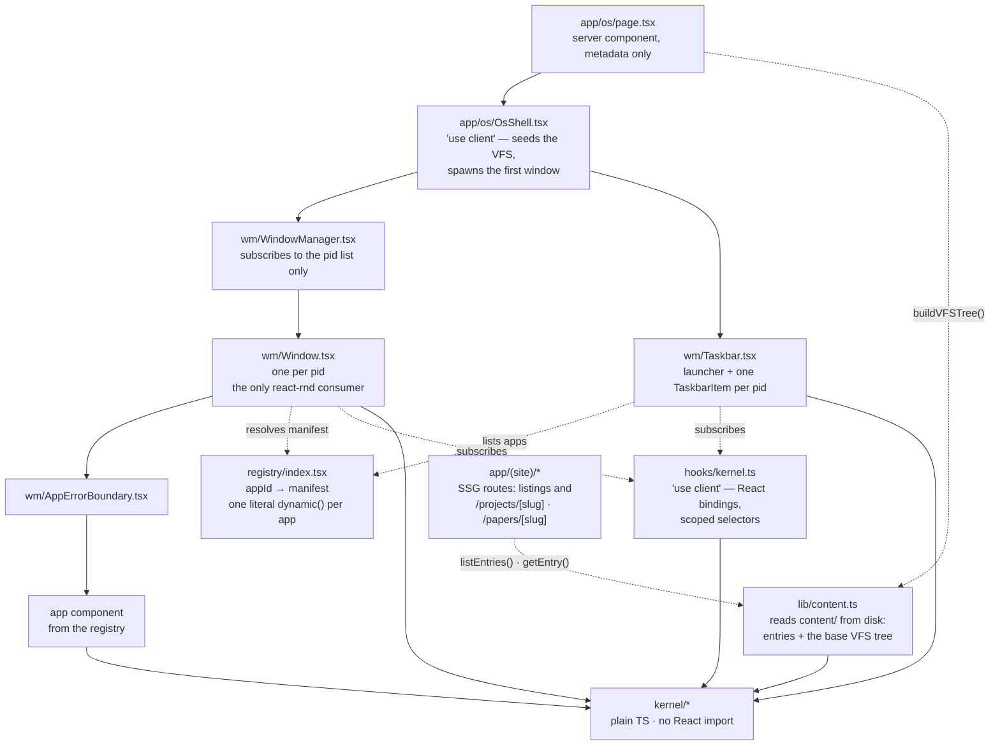
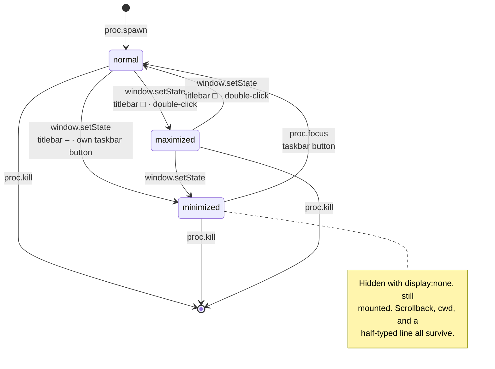
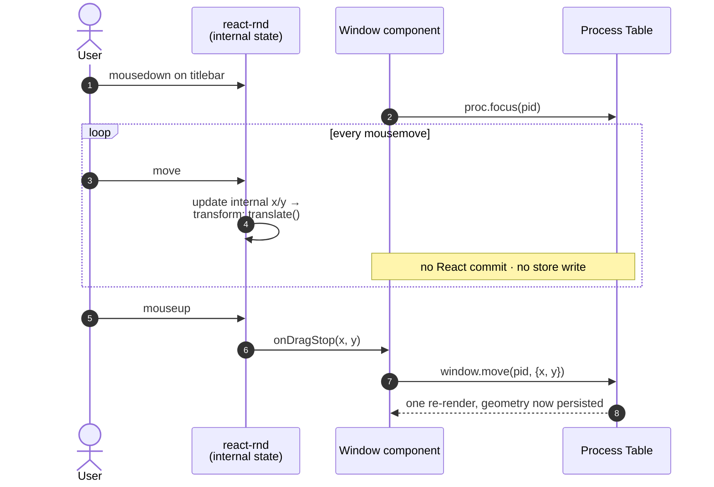
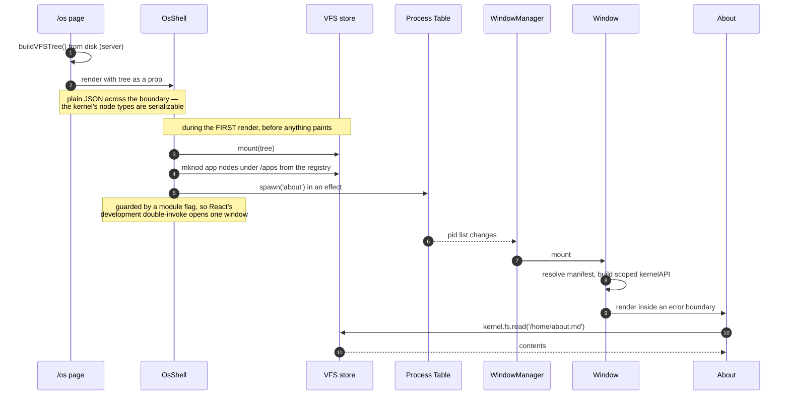
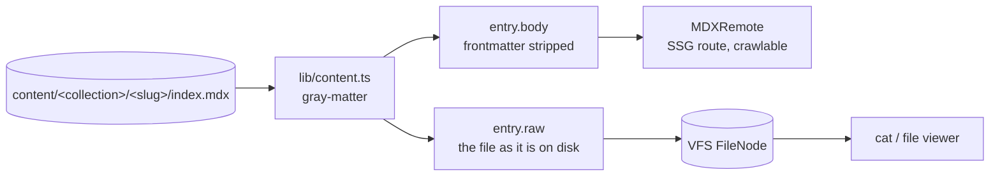
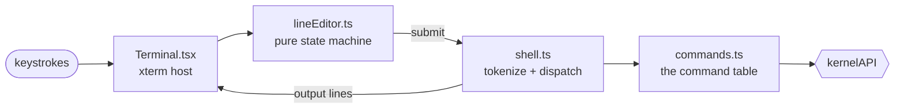

# Architecture (as built)

What the code actually does, as of commit `7d53389`.

This is the companion to [personal-os-portfolio.md](personal-os-portfolio.md):
that file is the design and the intent, this one tracks the implementation and
is updated whenever the implementation moves. Where they disagree, this file is
right and the design doc needs a patch.

**Status:** kernel, syscall boundary, registry, window manager, the content
pipeline with crawlable SSG routes, and a working shell. No file viewer, no
games; persistence shaped but not wired.

---

## 1. Layer map



The dependency rule, and the one worth enforcing in review: **`kernel/` imports
nothing from `apps/`, `wm/`, `registry/`, or `hooks/`.** Every arrow above
points *into* it and none point out. It does not know what an app is, only that
something asked to spawn a process or read a path.

---

## 2. Kernel

Three stores plus an API layer. All of `kernel/` is plain TypeScript using
`zustand/vanilla` — see [D-001](decisions.md).

### `kernel/vfs.ts`

```ts
type VFSNode = DirNode | FileNode | AppNode

DirNode   { type: 'dir',  name, children: Record<string, VFSNode>, meta? }
FileNode  { type: 'file', name, mime, content?: string, src?: string, meta? }
AppNode   { type: 'app',  name, appId, meta? }
```

`src` lets a large asset (a PDF) live in `/public` and stay out of the
serialized tree. `AppNode` makes launchables visible to the filesystem, so a
future shell gets `ls /apps` and `open /apps/about` without new machinery.

Pure path helpers, deliberately separate from the store so the shell can use
them and so they test without React: `normalize`, `join`, `resolvePath`,
`dirname`, `basename`, `resolve(root, path)`.

Two behaviours worth knowing:

- `normalize` treats `..` above the root as a no-op, as POSIX does, but
  preserves leading `..` on relative paths (which have no known root).
- `resolve` returns `null` rather than a node when the walk would descend
  *through* a file — `/notes.md/child` is not a path.

Writes copy only the spine of the tree (`setNode`), so untouched subtrees keep
their object identity. That is what makes selector-scoping possible at all.

### `kernel/process.ts`

```ts
Process {
  pid, appId, args, title,
  position: { x, y },
  size: { width, height },
  zIndex,
  state: 'normal' | 'minimized' | 'maximized'
}
```

Store also holds `focusedPid`, `nextPid`, `nextZIndex`. Focus and z-index are
owned centrally here, never per-window — design doc §2 warns that splitting them
is how z-index bugs appear.

**The load-bearing invariant:** every mutator leaves *untouched* process objects
referentially identical. `move`, `resize`, `focus`, and `setWindowState` rebuild
only the entry they change. Break this and every window re-renders on every
drag. Tested directly in `process.test.ts`.

Focus behaviour: `focus()` on a minimized window restores it; killing or
minimizing the focused window hands focus to the topmost survivor, not to
nothing; focusing the window already on top is a no-op that doesn't touch state.



Minimizing used to `return null`, which unmounted the app and destroyed its
state. [D-013](decisions.md) changed that: the frame stays mounted and is hidden
with `display: none`. The cost is memory rather than frame time, and it is what
makes a terminal survivable across a minimize.

### `kernel/events.ts`

`EventBus` over `Map<string, Set<handler>>`. `on()` returns its own unsubscribe
rather than exposing `off()` — `docs/gotchas.md` names uncleaned listeners as
the leak that kills a long-lived session, so the API hands you the cleanup you
need. `emit` iterates a copy, so a handler may unsubscribe mid-emit.

Currently emitted: `fs:changed` — `{ path, appId }`, on every `fs.write`.

### `kernel/api.ts` — the syscall boundary

`createKernelAPI(app: AppIdentity)` returns a handle closed over that app's
manifest. Every method calls `assertPermission` first.

```ts
fs.read(path)            → string | null   // file contents, not the node
fs.write(path, data)     → void            // also emits fs:changed
fs.list(path)            → VFSNode[]
fs.stat(path)            → VFSNode | null  // metadata: mime, src, appId

proc.spawn(appId, args?, title?) → number
proc.kill(pid)           → void
proc.focus(pid)          → void
proc.list()              → Process[]   // snapshot ordered by pid; backs `ps`

window.move(pid, pos)              → void
window.resize(pid, dims, pos?)     → void   // pos when a top/left handle moved the origin
window.setState(pid, windowState)  → void

events.emit(name, payload)  → void
events.on(name, handler)    → Unsubscribe
```

Permissions: `fs.read` `fs.write` `proc.spawn` `proc.kill` `proc.focus`
`proc.list` `window.manage` `events.emit` `events.listen`.

`systemAPI` is a handle with all permissions, used by the WM and taskbar — they
are policy layers of the system, not apps running on top of it, but they still
go through the boundary rather than touching stores.

Deviations from the doc's §3 sketch, all additive:

| Doc §3 | As built | Why |
|---|---|---|
| `fs.read(path)` returns a node | returns file text; `fs.stat` returns the node | §8.2 uses `fs.read('/…/README.md')` as content |
| `proc.spawn(appId, args)` | `+ title?` | so the launcher can label an instance without the kernel knowing app names |
| `window: { resize, move }` | `+ setState` | minimize/maximize needed a path through the boundary |
| manifest holds `permissions` | split: kernel sees `AppIdentity { id, permissions }`, registry adds `name/icon/component` | keeps React types out of `kernel/` |

### `kernel/persistence.ts`

`SCHEMA_VERSION = 1`, a `migrations` map keyed by the version being migrated
*from*, and `migrate(raw)` that returns `null` — never throws — for junk, a
missing migration step, or a blob written by a newer build. Null means "start
fresh"; a returning visitor should never see a crash.

`snapshot()` / `hydrate()` move state in and out of `PersistedState`:

```ts
{ schemaVersion, overlay: Record<path, content>, session: { processes, focusedPid, nextPid, nextZIndex } }
```

The base tree is **not** in the blob — see [D-003](decisions.md).
`createLocalStorageAdapter` and `createMemoryAdapter` implement `StorageAdapter`.

**Not wired.** Nothing auto-saves yet. Phase 2.

---

## 3. Render topology

Who re-renders when, which is the whole performance story:

| Event | Re-renders |
|---|---|
| Window dragged (during) | **nothing** — react-draggable's internal state only |
| Window dragged (on release) | that one `Window` |
| Window resized (on release) | that one `Window` |
| Focus changes | the two `Window`s + two `TaskbarItem`s whose focus flipped |
| Window opens / closes | `WindowManager`, `Taskbar`, and the new/removed `Window` |
| Window minimized / maximized | that `Window` + its `TaskbarItem` |
| File written | only components subscribed to that path |

`WindowManager` subscribes to `usePids()` (shallow-compared array), so it holds
still through every drag, resize, and focus change. See [D-006](decisions.md).

### The drag lifecycle

The single most important sequence in the codebase. Geometry has two owners
depending on whether a gesture is in flight:



The loop is the part to protect. `position`/`size` are passed to react-rnd as
*controlled* props, but react-draggable renders from its own internal state
while `dragging` is true and ignores the prop until the pointer lifts
(`Draggable.js:862`) — so passing controlled props costs nothing as long as
nothing writes them mid-gesture. Committing in `onDrag` instead of `onDragStop`
would put a store write inside that loop and re-render on every mousemove.

`Window.tsx` logs `[wm] pid N commit #M` on every commit in development, so this
is observable rather than assumed; `pnpm verify` asserts it.

---

## 4. App contract

An app is a default-exported component receiving:

```ts
{ pid: number, args: string[], kernel: KernelAPI }
```

The `kernel` handle is built from its manifest, so its permissions are baked in
and cannot be widened at the call site. Apps import nothing from `kernel/`
except types.

Adding one:

1. `apps/<name>/<Name>.tsx`, default export, typed `AppProps`
2. add a manifest to `registry/index.tsx` with a **literal** `dynamic()` import
   ([D-005](decisions.md))
3. optionally an `AppNode` in `content/index.ts` so it appears under `/apps`

No kernel change. That is the property design doc §3 is protecting.

Current apps, both deliberately thin:

- **`about`** — `['fs.read']`. Reads `/home/about.md` through the boundary
  rather than importing it, so the app→VFS path is proven. Has a "crash this
  app" button that throws during render, to demonstrate containment.
- **`sysinfo`** — `['fs.read', 'events.listen']`. Live kernel state; also exists
  so per-app code splitting is observable in the network tab.

---

## 5. Boot sequence



Mounting during the first render rather than in an effect is deliberate: the VFS
is populated before anything paints, so no window ever renders against an empty
filesystem.

`/apps` is registered client-side because the registry holds React components
and is necessarily a client module — the server loader builds only what it can
read off disk.

---

## 6. Content pipeline

`lib/content.ts` is the only module that knows how content is laid out on disk.
It is server-only by construction — it reads with `node:fs`, so it cannot reach
a client bundle without failing the build.

Directory per entry, so a writeup can carry assets:

```
content/
  home/about.md                       → /home/about.md          (inline)
  projects/<slug>/index.mdx           → /projects/<slug>/index.mdx
  papers/<slug>/index.mdx             → /papers/<slug>/index.mdx
  papers/<slug>/figure.txt            → FileNode with src, mirrored to /public
```

Frontmatter: `title`, `summary`, `date` (all required — a missing one throws
with the file path rather than shipping a blank `<title>`), plus optional `tags`
and `draft`.

One read on disk serves two consumers, which is the whole point of
[D-010](decisions.md):



`raw` keeps the frontmatter because that is what is actually in the file, and
what `cat` should print. `body` is what MDXRemote compiles.

**Drafts are asymmetric on purpose.** `draft: true` removes an entry from
`listEntries`, from the listing pages, and from `generateStaticParams` — so it
is never built and never crawled. It stays in the VFS, so work in progress is
still openable inside the OS. `pnpm verify:content` asserts both halves.

| Surface | Sees drafts? |
|---|---|
| `/papers` listing, `/papers/<slug>` route | no — 404 |
| VFS, and therefore the OS | yes |

**Routes.** `app/(site)/` holds the crawlable half with its own chrome; `/os`
sits outside that route group because it is full-viewport and brings its own.
Each detail route is a thin wrapper over `EntryArticle` — `generateStaticParams`
from `listEntries`, `generateMetadata` from frontmatter, `notFound()` otherwise.
`components/mdx.tsx` holds the typographic component map, and is the seam where
a writeup's own React components get registered.

## 7. The shell

The terminal is the first app with structure worth describing, and the structure
is the same idea as the kernel: **the shell does not know xterm exists.**



`lineEditor.ts` and `shell.ts` are plain TypeScript — no xterm, no React, no
DOM. xterm is one possible *device* attached to the shell. That is what lets all
of it be tested in a bare node environment; the terminal's browser checks only
have to prove the wiring, not the logic.

| File | Knows about |
|---|---|
| `Terminal.tsx` | xterm, the DOM, and nothing else worth testing |
| `lineEditor.ts` | buffer, cursor, history. Pure `(state, input) => [state, effects]` |
| `shell.ts` | tokenising and dispatch; formats `CommandError` into a line |
| `commands.ts` | the syscall boundary and a cwd |

**cwd is app state**, held per terminal instance, not in the kernel — design doc
§8.4 puts app-internal state in the app. Two terminals have two working
directories, which is the point of opening a second one.

Path handling reuses `resolvePath`/`resolve` from `kernel/vfs.ts` rather than
reimplementing it, so `cd ..` and the VFS agree by construction.

The terminal reacts to its **own box** via a `ResizeObserver` rather than
subscribing to the process table, so the WM stays unaware it exists. The
observer is rAF-debounced because a resize gesture fires it continuously, and it
skips `fit()` at 0×0 — which is exactly what a minimized window is under
[D-013](decisions.md).

Not implemented, deliberately: piping and redirection (design doc §2 calls them
a scope-creep magnet), persisted history, and tab completion. History exists but
only for the session.

## 8. Known gaps

- **Editing a wrapped command line corrupts the display.** `Terminal.tsx`'s
  `render()` repaints with `\r\x1b[2K`, which returns to the start of the
  *current* row and clears only that row. A line longer than the terminal width
  wraps, so the continuation rows survive the repaint and the prompt line is
  duplicated on screen. Reproduce: narrow the window, type a command past the
  right edge, press Ctrl+A and type. The buffer itself is correct — this is
  purely a repaint bug. Fix is to track how many rows the line occupies and
  clear upward before repainting.
- **Ctrl+C always cancels the line**, even with a selection, so it can never
  copy. Needs `attachCustomKeyEventHandler` to defer to the browser when
  `term.hasSelection()`.
- **`open` focuses the first running instance** of an app rather than the most
  recently used one. Only observable once something is spawned twice.
- **`open` on a file is a dead end.** It names the missing handler
  (`no application registered for text/markdown`) rather than doing anything.
  The file viewer is the next app and will register as the handler.
- **All content ships in the `/os` payload.** `kernel.fs.read` is synchronous,
  so the whole tree — every entry's full text — must be in memory client-side
  for `cat` to work at all ([D-011](decisions.md)). Fine at tens of entries,
  wrong at hundreds. The fix is `FileNode.src` plus an async read path, which
  makes it a kernel change rather than a content one.
- **Persistence not wired** (§ above).
- **Permissions are per-app, not per-pid** — [D-004](decisions.md).
- **No accessibility work.** Design doc §5 asks for ARIA roles, per-window focus
  traps, and keyboard equivalents. Windows are divs; only the buttons are
  reachable by keyboard. Nothing here blocks it, but nothing implements it.
- **No mobile mode.** Design doc §5 wants a genuinely different full-screen
  single-app mode, not a responsive squeeze. Not started.
- **No URL sync.** Window/path state isn't reflected in the URL, so the back
  button does nothing. §5 warns this is hard to retrofit.
- **Placeholder slugs are not final.** `project-one`, `paper-one` etc. are
  stand-ins. Renaming one moves both a published URL and a VFS path — cheap
  now, a redirect to maintain once anything links in. Worth settling before the
  site is public.
- **Manifests are centralized** in `registry/index.tsx` rather than one per app.
  Fine at three; per-app `manifest.ts` files (each with their own literal
  `dynamic()`) scale better and keep an app self-contained. Noted in design doc
  §8.3 as well.
