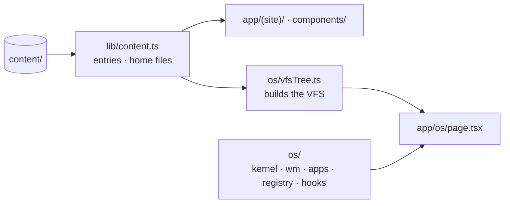
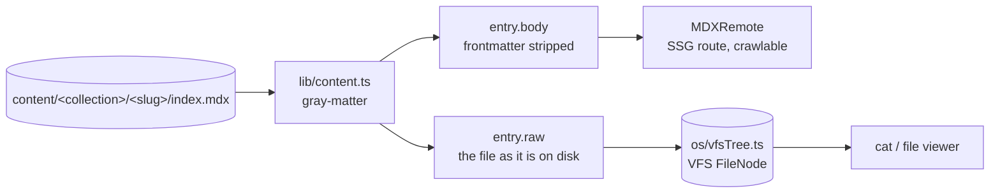
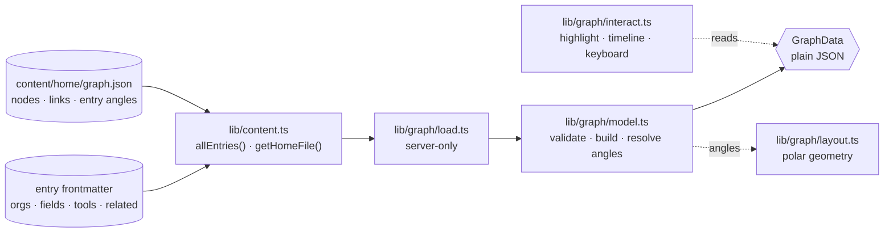
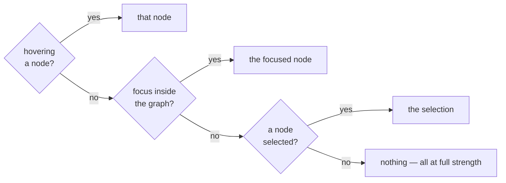

# Architecture (as built)

What the site's code does right now. It is the companion to
[design.md](design.md), which holds the intent. Where the two disagree, this
file is right and the design doc needs a patch.

**Status, 2026-09-28:** the site is a set of server-rendered pages built from
`content/` — a home page listing the work, `/about`, and a listing and detail
route per collection. It is being rebuilt around a knowledge graph of the work
([plan](plans/2026-09-27-graph-home.md)). The graph is built and drawn on `/`
— [§ The home graph](#the-home-graph) — with hover tracing, an inspector,
keyboard navigation, a timeline, a phone layout, and a checked accessibility
baseline ([§ Phone and accessibility](#phone-and-accessibility)). The
OS that used to be the site's framing is now a separate, frozen project in
`os/`, documented in [os/architecture.md](os/architecture.md).

---

## Structure: the site and the OS

```
app/
  (site)/          the site's chrome, and the home page
    (reading)/     /about and the collections, at reading width (D-043)
  os/page.tsx      /os — a route only; everything behind it lives in os/
  layout.tsx sitemap.ts robots.ts
components/        entry.tsx (article, listing), mdx.tsx (typography), graph/ (the home graph)
lib/               content.ts (the pipeline), graph/ (the home graph), memo.ts, site.ts
os/                the OS: kernel/ wm/ apps/ registry/ hooks/, OsShell.tsx, vfsTree.ts
content/           the source of truth for both
```



**The dependency runs one way** ([D-037](decisions.md)). The OS reads content
through `lib/content.ts`, exactly as the site's routes do. Nothing outside `os/`
and `app/os/` imports the OS, and the OS imports from the site only
`lib/content`, `lib/memo` and `components/mdx` — the last for the viewer's prose
styling ([D-018](decisions.md)). `lib/boundary.test.ts` asserts both directions
by reading every source file's imports; a violation fails `pnpm test` with the
offending file and specifier.

The OS is **frozen, not archived**: its 463 unit tests still run in
`pnpm test` and its browser checks still pass, so a site change that breaks it
fails loudly. Its open work is [os/backlog.md](os/backlog.md).

---

## Content pipeline

`lib/content.ts` is the only module that knows how content is laid out on disk.
It is server-only by construction — it reads with `node:fs`, so it cannot reach
a client bundle without failing the build.

Directory per entry, so a writeup can carry assets:

```
content/
  home/whoami.md                      → /about, and `whoami` in the OS
  home/graph.json                     → the home page's graph, and /home/graph.json in the OS
  home/about.md · readme.md · now.md  → the OS's /home
  projects/<slug>/index.mdx           → /projects/<slug>
  papers/<slug>/index.mdx             → /papers/<slug>
  presentations/<slug>/index.mdx      → /presentations/<slug>
  <collection>/<slug>/figure.png      → mirrored to /public by the prebuild step
```

**Tested on fixtures.** `lib/content.ts` computes its directory from
`process.cwd()` at import — which also keeps Turbopack's file tracing scoped to
`content/`. Tests that check how the pipeline *behaves* load a second copy of
the module with `cwd` pointed at `lib/__fixtures__/`, whose `content/` holds
exactly one published entry and one draft, so draft behaviour is tested
whatever real content happens to hold ([D-038](decisions.md)).

Frontmatter: `title`, `summary`, `date` (all required — a missing one throws
with the file path rather than shipping a blank `<title>`), plus optional `tags`
and `draft`. Every field, named or not, is also on `entry.frontmatter` — YAML
dates turned back into `YYYY-MM-DD` — and `entry.sourcePath` is the file
relative to the repo, so a consumer that reads its own fields (the graph reads
`orgs`, `fields`, `tools`, `related`) can name the file when one is wrong.

A published entry whose summary still starts with `DRAFT` is listed by
`scripts/warn-placeholder-summaries.mjs` during `prebuild` — a warning, not a
failure.

One read on disk serves every consumer, which is the whole point of
[D-010](decisions.md):



`raw` keeps the frontmatter because that is what is actually in the file, and
what the OS's `cat` prints. `body` is what MDXRemote compiles.

**Drafts are asymmetric on purpose.** `draft: true` removes an entry from
`listEntries`, from the listing pages, from the sitemap and from
`generateStaticParams` — so it is never built and never crawled. It stays in
`allEntries`, so the OS still shows it.

| Surface | Sees drafts? |
|---|---|
| `/papers` listing, `/papers/<slug>` route, sitemap | no — 404 |
| the OS | yes |

**Loose files.** `content/home/` is not a collection. `getHomeFile(name)` reads
one file for a route — `/about` renders `whoami.md`, the same bytes the OS's
`whoami` prints ([D-036](decisions.md)). `listHomeFiles()` lists them all with
the URL of their mirrored copy; the OS mounts every one at `/home`.

---

## The home graph

The home page's knowledge graph, built from content ([D-039](decisions.md))
and drawn on `/`.



| Module | Pure? | Does |
|---|---|---|
| `lib/graph/model.ts` | yes | types; `buildGraph(spec, entries, options)` — parses and validates `graph.json`, resolves every entry's references, builds nodes and edges, dates them for the timeline, fills in missing angles |
| `lib/graph/layout.ts` | yes | clock-angle geometry: `polar`, `nodePoint`, `circularMean`, `widestGapMidpoint`, `minSeparation`; labels: `labelSide`, `labelBox`, `overlaps`; the frame: `DESKTOP` (with `centreRadius`), `scaleGeometry`, `HIT`, `LABEL_FONT`, `MIN_SEPARATION` |
| `lib/graph/interact.ts` | yes | `indexGraph`, `highlight` (node, neighbours, the edges from it), `visibleAt(year)`, `timelineYears` (every year of the span), `joinedIn(year)` (what that year adds), `nextNode` (keyboard moves), `kindLabel`, `connections` (the inspector's groups), `allWork` (every entry, newest first) |
| `lib/graph/load.ts` | no | `loadGraph()` — reads `graph.json` and every entry, memoised like the content loader |

The pure three are what the client component imports; `purity.test.ts`
fails if any of them imports `node:*`, React, Next, `lib/content`, the OS or
`load.ts`. Type-only imports are allowed, since they are erased.

**Shape.** `GraphData` is `{ nodes, edges, years }` — plain objects, which is
how it crosses from the server component to the client, exactly as `/os`
receives its filesystem ([D-011](decisions.md)).

| Node kind | Ring | Id | From |
|---|---|---|---|
| `me` | 0 | `me` | `SITE_NAME`, linking to `/about` |
| `org`, `field` | 1 | `org:iris-hep` | `graph.json` — always shown |
| `entry` | 2 | `entry:papers/hq` | published entries |
| `tool` | 3 | `tool:python` | `graph.json` — hidden when nothing published uses it |

Edges are undirected, one per pair, with id `a|b` sorted: me to every inner
node, entries to what their frontmatter names and to their `related` entries,
and `graph.json`'s `links`. A node's `year` is its entry's date, or `since`, or
its earliest connected published entry, or null — always shown.

**Validation** ([D-040](decisions.md)) throws naming the file: an unknown id, the
wrong kind, an unresolvable or ambiguous `related`, a self-reference, a
`graph.json` key naming no entry, and any malformed or unknown key in
`graph.json`. References to drafts are dropped instead. Drafts are validated
too.

**Layout** ([D-041](decisions.md)): hand-set angles win; a missing one takes the
circular mean of its neighbours on the ring inside, else the widest empty arc,
in id order. An entry with a long title can take a short `label` in
`graph.json`; its full title stays in the inspector. `load.test.ts` holds the
real graph to three legibility rules: a minimum angle between nodes on a ring
and no label overlapping another label, another node's mark, or the centre disc
and its glow — both in every timeline year, the labels at full size and at 80%
([D-042](decisions.md)) — and no straight edge passing through a node that is
not one of its ends, the centre excepted ([D-046](decisions.md)).

The real graph, as of this commit: 33 nodes, 49 edges, 2023–2026.

### Drawing it

```
app/(site)/page.tsx                 server — loadGraph(), then <KnowledgeGraph graph={…} />
components/graph/KnowledgeGraph.tsx 'use client' — interaction state only
components/graph/GraphCanvas.tsx    the SVG: edges and marks. aria-hidden, no pointer events
components/graph/NodeLayer.tsx      one <button> per node (the OS: a link), over its mark
components/graph/Inspector.tsx      the panel: the selected node, or the centre with all the work when nothing is
components/graph/Legend.tsx         how to read the marks — above the inspector, beside the intro; no state
components/graph/columns.ts         GRAPH_COLUMNS, the two-column template the legend row and graph row share
components/graph/Timeline.tsx       under the drawing: Replay, the year slider, what is shown
components/graph/InspectorSheet.tsx the phone's inspector: a bottom sheet on a native <dialog>
```

The page builds the graph during its static render, so a bad reference in any
entry **fails `pnpm build`**, naming the file. `/` is still fully static.

**Two layers, one coordinate function** ([D-042](decisions.md)). The SVG draws;
the HTML layer above it is what you touch. Both place nodes with `nodePoint` in
the `DESKTOP` frame (800 × 660, rings at 110 / 200 / 290, a centre disc of
radius 48), and the box keeps that aspect ratio, so a control sits exactly over
its mark. The rings place nodes but are not drawn ([D-045](decisions.md)).

**The centre** is a disc in the site's accent (`--accent`, amber) with a soft
glow and the first name inside it; its control is a round button sized in
percentages of the frame, so it scales with the drawing. It is the only colour
on the graph. When something else is traced it fades to 35% rather than 18%,
over a solid disc in the background colour so edges do not show through. Each control is an
invisible 20px square over the mark plus the label, on the side `labelSide`
picks — outward, or above and below near 12 and 6 o'clock.

**What lights up** is one rule, in `KnowledgeGraph`:



With nothing hovered, focused or selected, nothing is active and the whole
graph is at full strength, while the inspector shows the centre
([D-049](decisions.md)).
The active node, its neighbours and the edges from it stay at full strength;
everything else goes to opacity 0.18, with a 150ms transition that
`motion-reduce` turns off. Edges are straight lines, node to node
([D-046](decisions.md)); one that crosses the middle passes under the centre
disc.

**Keyboard.** One tab stop — a roving `tabindex` — then `←`/`→` round a ring,
`↑`/`↓` across rings, `Home` to the centre, `Enter` to select, `Escape` to clear.
Moves come from the pure `nextNode`. Instructions are in a visually hidden
paragraph the group points to with `aria-describedby`, and each control's
accessible name adds its kind and year ("TreeViz, Project, 2025").

**The inspector** shows, for a selected node: its kind and date, title, summary,
tags, a link to its page (or an organisation's site), and its connections
grouped by kind as buttons that select them — a way to walk the graph without
a pointer. With nothing selected it shows the centre: the intro (`SITE_INTRO`),
"About me", the organisations and fields, and all the visible work, newest
first (`allWork`) — with no ×, since there is nothing to clear. The legend is a
separate box above it ([D-048](decisions.md)). The OS node is a
link rather than a button: clicking it boots the OS ([D-044](decisions.md)).

**Clearing the selection** takes the inspector's ×, `Escape`, clicking the
selected node again, or a click on blank space — anywhere on the page that is
not a control (`a`, `button`, `input` …) or the inspector itself. The last is a
document listener that `KnowledgeGraph` holds only while something is
selected, and it ignores a click that ends a text selection.

**The timeline** ([D-047](decisions.md)) sits under the drawing: a Replay
button, a native range input over `timelineYears` (2023–2026 today), and how
many of the nodes are shown. The year is state in `KnowledgeGraph`; the page
filters both layers through `visibleAt(year)`. It starts at the last year, so
the server render and the page without JavaScript show the whole graph, and
the controls are disabled until hydration. Replay jumps to the first year and
steps forward every 900ms, stopping after the last; touching the slider stops
it. What a forward step adds (`joinedIn`) fades in (`.graph-enter` in
`globals.css`, off under reduced motion). A node the timeline hides stops being
hovered, focused or selected until it returns; the selection is kept and comes
back with it. The listings under the graph do not follow the timeline.

### Phone and accessibility

([D-050](decisions.md).) **Below `md` (768px)** the drawing's box is square and
clips: `cropStage` gives the size and offset of the full desktop frame inside a
square just around the outer ring, and a stage `div` carries both layers at
those percentages through CSS variables. Nothing is recomputed — every node
keeps its desktop coordinates — so the switch is pure CSS and cannot flash on
hydration. Only the centre and the inner ring are labelled (`labelledOnPhone`),
at 12px, by a node's `short` name when `graph.json` gives one; each takes the
side `phoneLabelSides` picks at 360px — its desktop side if that fits inside
the square and clear of every label and mark, else above or below. The centre's
name drops to 9px. A tap selects; on a phone that opens `InspectorSheet`, a
native `<dialog>` shown with `showModal()`, so Escape, focus containment, the
backdrop and focus return are the platform's; closing it clears the selection.
The panel under the graph keeps showing the centre. Gutters are 16px.

**Accessibility.** Measured by `pnpm verify:graph`, not assumed:

- **Contrast, WCAG AA**, every text node at rest in both themes. Dark mode lifts
  `neutral-500` to `#8a8a8a` inside `[data-site]` (4.2:1 → 5.7:1); tags and the
  timeline's count moved off `neutral-400`/`600`, which failed in both themes.
  Faded nodes (18%) are exempt by design: they are the de-emphasised state, and
  every one is reachable by hovering it or through the inspector.
- **Targets, WCAG 2.5.8**: each node's hit square is 24px (`HIT`), with the
  label 2px beyond it (`LABEL_GAP`), so labels sit where they did.
- **Announcements**: a polite live region says "Selected …" on a selection and
  "2024: 6 of 33 nodes" at each step of a replay. Scrubbing by hand says
  nothing there — the slider's own `aria-valuetext` already does.
- **Names**: each control's accessible name is the full title, kind and year,
  even when the visible label is short or hidden.
- **Reduced motion**: no fades (`.graph-enter`), no opacity transitions.

**No prefetch of `/os`.** Every site link to `/os` sets `prefetch={false}` —
the graph's OS node, the inspector's button, and the writeup footers. `/os`
is static, so a prefetch would pull the entire VFS. The one exception is the
`personal-os` page's own "Launch the OS" link, where booting is the likely next
step.

---

## Routes

`app/(site)/` holds the site with its own chrome — header, nav and footer, each
in the home page's wide frame (`max-w-[82rem]`), so the name sits in one place
on every page ([D-048](decisions.md)). The header's home link reads `home`; the chrome has no link
to `/os`, which is reached from its node and its project page. `/about` and
the collections sit in the nested `app/(site)/(reading)/` group, whose layout
is the `max-w-3xl` column, centred; the home page sits outside it and uses the
whole frame: intro and legend in one row, graph and inspector in the next,
both on `GRAPH_COLUMNS`, then the listings at reading width on the left
([D-043](decisions.md), [D-048](decisions.md)). `/os` sits outside `(site)` altogether because
it is full-viewport and brings its own.

| Route | Renders |
|---|---|
| `/` | name and introduction; the graph ([§ The home graph](#the-home-graph)); then the three collections through `EntryList`, server-rendered, which do not depend on the graph or on JavaScript |
| `/about` | `HomeArticle` over `content/home/whoami.md` |
| `/projects` · `/papers` · `/presentations` | `EntryList` for the collection |
| `/<collection>/<slug>` | `EntryArticle` — `generateStaticParams` from `listEntries`, `generateMetadata` from frontmatter, `notFound()` otherwise |
| `/os` | the OS ([os/architecture.md](os/architecture.md)) |

Every route is static. `components/mdx.tsx` holds the typographic component
map, and is the seam where a writeup's own React components get registered;
its anchor renders internal links through `next/link`.

## Metadata

`lib/site.ts` holds the canonical URL, name and description; the root layout
sets `metadataBase` and the title template from it, and `app/sitemap.ts` and
`app/robots.ts` read the same constant. The sitemap is built from
`listAllPublished()`, so a draft cannot leak into it and a published entry
cannot be left out.

## Tests

`pnpm test` runs everything under `lib/` and `os/` in bare node — no jsdom, no
browser. For the site: the content pipeline against fixtures and against real
content (`lib/content.test.ts`), the OS boundary (`lib/boundary.test.ts`), and
the graph — its rules on fixtures (`model`, `layout`, `interact`), the real
content against those rules and the separation limits (`load`), and the purity
of the modules the client will import (`purity`).
`pnpm verify:content` checks in real Chrome that a published entry renders with
JavaScript disabled and that the OS reads the same bytes.

---

## Known gaps

- **`stat` in the OS does not show the graph fields.** `cat` does. On the
  [OS backlog](os/backlog.md).
- **Published summaries are placeholders.** All seven published entries still
  read `DRAFT — replace this.`
- **Phones narrower than 360px** get the phone layout unchecked: at 320 the
  inner ring's own labels collide (CERN/CMS and Fermilab).
- **Label sizes are estimated, not measured**, in the legibility tests
  (`labelBox`); the estimate errs wide. `verify:graph` sees the real page but
  does not check collisions.
