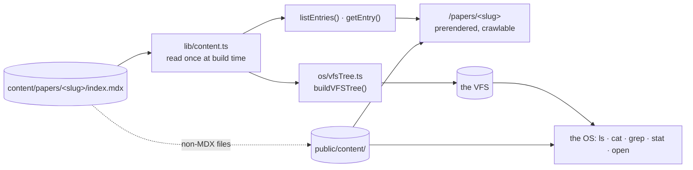

# Authoring content

How to add a project or a paper, and what happens to it afterwards.

---

## Where content lives, and why it has to

**Published work goes in `content/` on disk, in git.** Not by preference — by
constraint.

The crawlable routes are prerendered at build time from disk. Anything written
*inside the OS* lands in the localStorage overlay: one browser, one machine. It
would have no URL, no `<meta>` tags, no server-rendered markup — invisible to
search engines and to anyone you send a link to, and gone the moment site data
is cleared. That is exactly the failure design doc §5 names as the most common
in this genre, and [D-010](decisions.md) exists to prevent it.

The VFS already draws this line ([D-003](decisions.md)):

| Tier | What | Lives in | Who sees it |
|---|---|---|---|
| **Base tree** | published work | `content/`, in git | everyone — crawlers, the web, the OS |
| **Overlay** | scratch, shell history | localStorage | only that browser |

So an in-OS editor would be a legitimate thing to build — for notes and as a
demonstration that the filesystem is genuinely real — but it is not the path for
a writeup that needs a URL.

The shell can now create, copy, move, and delete — but only within the overlay.
Published content is read-only there ([D-027](decisions.md)): `rm` on a writeup
is refused, and `rm` on one you have *edited* reverts it rather than deleting
it. Nothing you do in the OS can change what is in `content/`.

---

## Adding an entry

One directory per entry:

```
content/papers/hscp-mass-reconstruction/
  index.mdx        ← required: frontmatter + prose
  figure.png       ← optional: any assets, beside the writeup that uses them
  paper.pdf
```

`index.mdx` starts with frontmatter:

```yaml
---
title: HSCP Mass Reconstruction
summary: One sentence. Used on listing pages and as the meta description.
date: 2026-08-12
tags: [physics, cms]
draft: false
---
```

| Field | Required | Notes |
|---|---|---|
| `title` | yes | `<title>`, the listing heading, and `stat` in the shell |
| `summary` | yes | listing subtitle and `<meta name="description">` — write it for a stranger |
| `date` | yes | `YYYY-MM-DD`. Sorts the listings, newest first |
| `tags` | no | drives the `tags` command; lowercase |
| `draft` | no | `true` hides it from the web but keeps it in the OS |
| `venue` | no | for `presentations` — the event |
| `location` | no | for `presentations` — where it was |

Any other field you add stays in the file, so `cat` in the OS shows it and it
costs nothing to add. It is **not** shown by `stat`, which prints only the named
fields above — making `stat` show every field is on the
[OS backlog](os/backlog.md).

`title`, `summary`, and `date` are enforced: a missing one **fails the build**
with the file path, rather than shipping a blank `<title>`.

**Keep a colon out of the `title`.** YAML would force you to quote it, and
`lib/content.test.ts` asserts that the raw file contains `title: <the title>`
verbatim — because `cat` and `stat` show the file on disk, and a quoted title
means the two surfaces no longer agree about what a writeup is called. An em
dash does the same work as a colon and needs no quoting.

Then write MDX — markdown, plus React components if you register them in
`components/mdx.tsx`. See the caveat at the bottom before you do.

---

## What happens to it



One read on disk feeds both surfaces ([D-010](decisions.md)), which is why the
web page and the OS can never disagree about what a paper says.

**On the web** — `/papers/<slug>` is prerendered. The prose is in the server
markup, so it works with JavaScript disabled.

**In the OS** — the same file. `cat` prints it exactly as stored, frontmatter
and all. `stat` prints its title, summary, date, tags and draft flag. `grep` searches the text,
`tags` indexes the tags, `open` hands it to the viewer.

**Assets** — anything that is not `.mdx` or `.md` is mirrored into
`public/content/` by a prebuild step ([D-012](decisions.md)) and appears in the
VFS as a node carrying a `src` rather than inline bytes. That is how a PDF stays
out of the page payload.

---

## Slugs

The directory name becomes three things:

```
content/papers/hscp-mass-reconstruction/index.mdx   ← directory
        /papers/hscp-mass-reconstruction            ← public URL
        /papers/hscp-mass-reconstruction/index.mdx  ← VFS path
```

The mapping is one-to-one with no lookup table, so **renaming an entry is
renaming its directory** — everything follows.

Cheap now. Once anything links to a URL, renaming means maintaining a redirect
forever, so settle slugs before publishing. Lowercase kebab-case, no dates (the
date is frontmatter), and chosen to still make sense in two years. A test
enforces the character set.

---

## Drafts

`draft: true` removes an entry from the listings, from `generateStaticParams`,
and from its route — which returns 404. It stays in the VFS, so you can read and
`grep` work in progress inside the OS without it being crawlable.

The asymmetry is deliberate and asserted by `pnpm verify:content`.

---

## Adding a collection

Collections are the top-level groupings — `projects`, `papers`, `presentations`.

The split is by *artifact*, not by venue ([D-026](decisions.md)): `papers` is
written research, `presentations` is anything delivered at an event, posters
included, because a poster's metadata looks like a talk's and nothing like a
paper's. Attending a conference without presenting does not earn an entry.

Adding a collection takes four steps:

1. `content/<name>/` with at least one entry
2. add `'<name>'` to `COLLECTIONS` in [lib/content.ts](../lib/content.ts)
3. copy `app/(site)/papers/` to `app/(site)/<name>/` — the listing page and the
   `[slug]` route, both of which are thin wrappers; change the collection string
4. add it to the nav in `app/(site)/layout.tsx`

Step 2 is easy to forget, so `pnpm test` fails if a directory under `content/`
is not a declared collection. Without that guard, forgetting it means the
entries appear **in the OS but have no web pages** — a silent half-state, and
the exact failure this pipeline exists to prevent.

---

## Two caveats

**Embedded React components render differently in the two surfaces.** The web
route compiles MDX properly; the OS viewer uses `react-markdown`
([D-016](decisions.md)) and would show raw JSX as text. Nothing uses this yet.
If you want a live demo inside a writeup, say so — the viewer needs handling
first.

MDX comments — `{/* … */}` — are safe: both surfaces strip them, so they are a
good place for working notes while a writeup is in progress. **An HTML comment
is not**, and neither is a stray `{` or `}` in prose or inside a comment: any
`{…}` is parsed as a JavaScript expression, and a malformed one fails the build
with `Could not parse expression with acorn` rather than pointing at the line.

**`content/home/`** is not a collection — it is loose content. `about.md` is
what the OS's About app shows; `readme.md` is a guide to the filesystem for anyone
exploring with the shell; `whoami.md` is the bio, and is the one file rendered
in two places at once — the `whoami` command and the `/about` route
([D-036](decisions.md)). Text files there are inlined so `cat` works; anything
else gets a `src` like an entry asset.

Files under `content/home/` that have a web route are **compiled as MDX**, so
the comment rule above applies to them too — even though they are `.md`.

---

## Checklist

```bash
pnpm test        # frontmatter, slugs, collection layout
pnpm build       # every published entry should appear as ● (SSG)
pnpm dev         # then check /papers/<slug> and `open` it in the OS
```
