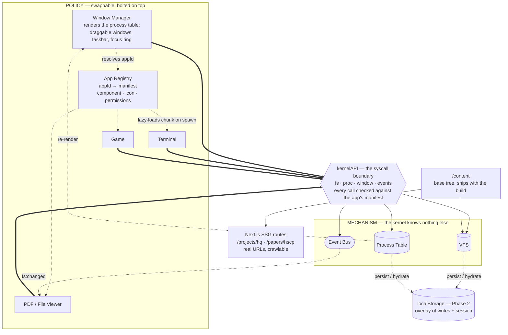
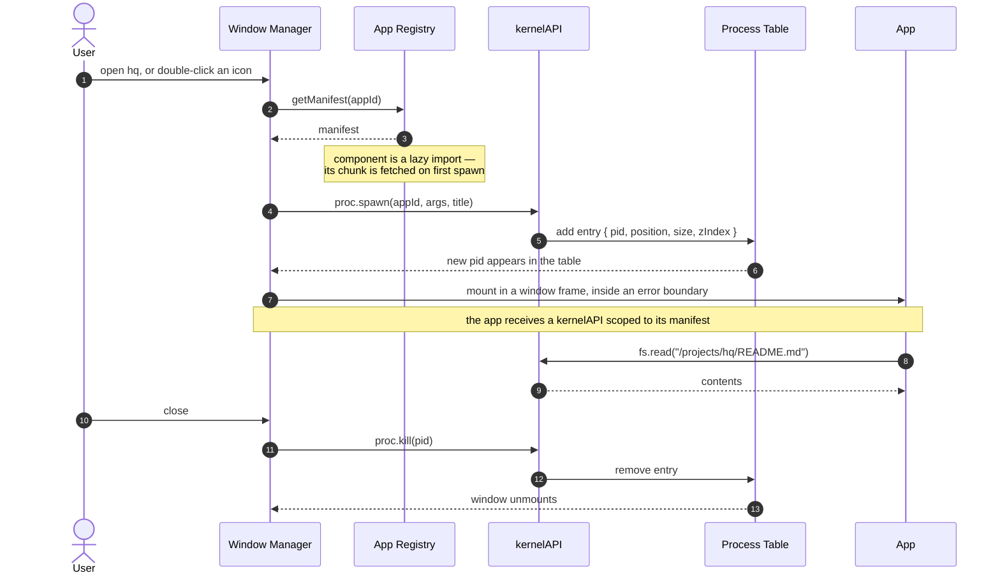

# Personal OS Portfolio — Design Doc

A web-based mock operating system serving as a personal portfolio product. Modeled philosophically after Slackware/classic UNIX: mechanism over policy, small composable pieces, nothing automated behind your back.

> **This file is the design and the intent.** For what the code currently does,
> see [architecture.md](architecture.md); for why specific choices were made,
> [decisions.md](decisions.md). Sections below marked **▸ Built** or
> **▸ Decided** have been reconciled with the implementation.
>
> Doc map: [README.md](README.md)

---

## 1. Design Philosophy

The core idea borrowed from UNIX (and specifically Plan 9 / X11): **mechanism, not policy**.

- The **kernel** provides primitives only — a virtual filesystem, a process/window table, an event bus. It stays deliberately dumb about how things look or behave.
- Everything else — the window manager, the terminal's command set, individual apps — is **policy**, bolted on top, swappable.
- This split is what makes "limited to what I have there and what I allow" actually true: the kernel only knows about objects you've registered, nothing more.

Secondary influence: the **desktop/window metaphor** (icons, draggable windows, taskbar) comes from Xerox PARC / early Mac — a separate lineage from UNIX, layered on top as one possible "policy" implementation.

Reference implementations worth dissecting (not necessarily reusing): **daedalOS** (React, real VFS, WM, terminal), **Puter.com**, **os.js.org**.

---

## 2. Layer Breakdown

### Kernel layer (state, not rendering)
A JS/TS object graph, not a component. Three things live here:

- **VFS** — tree of nodes: `{ type: 'dir' | 'file' | 'app', path, meta, content }`. Papers and projects are nodes; `cd /projects/hq` walks this tree.
- **Process table** — flat map of open windows: `{ id, appId, position, size, zIndex, state: 'normal'|'minimized'|'maximized', focused }`.
- **Event bus** — pub/sub so WM, shell, and apps communicate without direct references.

Kernel state should be serializable to JSON on its own, independent of the rendering framework.

### Shell / terminal
- **xterm.js** handles emulation (cursor, scrollback, ANSI) — don't hand-roll this. **▸ Built** — note the package is now `@xterm/xterm` (6.0); the unscoped `xterm` on npm is the old one.
- A small command dispatcher on top: tokenize input → look up in a command table (`ls`, `cd`, `cat`, `open`, `help`, ~8 commands to start) → call function → read/write kernel state. **▸ Built** — ten commands. The dispatcher and the line editor are pure TypeScript with **no xterm dependency at all**: xterm is a *device* attached to the shell, not the shell itself, which is the same mechanism/policy split as the kernel and means every command is tested in bare node.
- Piping/redirection: skip for V1, real scope creep magnet. **▸ Held** — still skipped.

### Window manager
- Renders the process table; doesn't own state.
- Drag/resize via **react-rnd** or **interact.js** — pick one.
- Focus management (click-to-front, last-focused tracking) must live centrally in the kernel, not per-window local state, or z-index bugs appear fast.

### Apps
- Self-contained components, each given a window "slot."
- Read/write only through the kernel's API — never reach into another app's state directly.
- Wrap each in an error boundary so one broken app doesn't crash the session.

---

## 3. The Syscall Boundary (core architectural decision)

Since the OS is the product — not just a portfolio wrapper — apps must never touch kernel state directly. They talk through a fixed API:

**▸ Built** — `kernel/api.ts`. The shipped surface, with the sketch's shape intact and four additions:

```ts
// createKernelAPI(manifest) returns this, closed over that app's permissions
const kernelAPI = {
  fs:     { read(path), write(path, data), list(path), stat(path) },
  proc:   { spawn(appId, args?, title?), kill(pid), focus(pid) },
  window: { resize(pid, dims, pos?), move(pid, pos), setState(pid, state) },
  events: { emit(name, payload), on(name, cb) }   // on() returns unsubscribe
}
```

- `fs.read` returns **file text**, not the node — which is how §8.2 already used it. `fs.stat` returns the node when you want mime, `src`, or an app target.
- `proc.spawn` takes a `title`, so a launcher can label an instance without the kernel ever learning app names.
- `window.setState` gives minimize/maximize a path through the boundary instead of around it.
- `events.on` hands back its own unsubscribe rather than exposing `off()` — see §5, listener cleanup.

Every app declares a manifest:

```ts
{
  id: 'terminal',
  name: 'Terminal',
  icon: '/icons/term.svg',
  component: TerminalApp,
  permissions: ['fs.read', 'fs.write']
}
```

Split in two on implementation: the kernel only ever sees `AppIdentity { id, permissions }`, and the registry adds `name`/`icon`/`component` on top. That is what keeps React types out of `kernel/` entirely.

Permissions are checked on **every** call, throwing `PermissionDeniedError`. Not because there is anything to defend against with one user — §4 is right that there isn't — but so that adding a plugin system later isn't a rewrite of every call site. The boundary is real; the policy is still a stub.

A central **app registry** maps `appId -> manifest`. Adding a new app later becomes "write component, register manifest" — never a kernel change. This is the actual product architecture decision; everything else is detail.

One constraint discovered while building: each manifest must carry its own **literal** `dynamic(() => import('…'))`. Next cannot match an interpolated path back to a chunk, so the obvious `import(\`@/apps/${appId}\`)` silently defeats code splitting rather than failing loudly.

---

## 4. Phased Build

**Phase 1 (ship this)** — *in progress*
VFS ✅, process table ✅, WM ✅, shell with ~8 commands ✅ (ten), 2–3 real apps (terminal ✅, file/PDF viewer ⬜, one game ⬜), your content loaded as VFS nodes ✅ (real MDX pipeline; placeholder prose pending).

Also done and not originally listed here: the syscall boundary with permission checks, the app registry with per-app code splitting, per-window error boundaries, and the persistence *shape* (see Phase 2). The SSG content routes from §5 are also done, and were arguably always part of this phase.

**Phase 2**
Persistence (localStorage, versioned schema), more apps, window snapping/tiling, command history/autocomplete.

**Phase 3 (only if actually wanted)**
Accounts/auth for cross-device persistence, a plugin system for redeploy-free app additions, a real backend VFS instead of a static JSON tree.

Don't build Phase 3 primitives now. A permissions system with no second user is complexity with no payoff yet — the manifest's `permissions` array is stub enough to avoid painting into a corner.

---

## 5. Gotchas

- **SEO/crawlability** — papers/projects need real server-rendered routes (Next.js SSG) independent of the client-rendered OS shell. The OS is a client for browsing content that has real URLs, not the only way in. Most common failure mode in this genre. **▸ Built** ([D-010](decisions.md)) — `/projects/[slug]` and `/papers/[slug]` are prerendered by `generateStaticParams`, with `generateMetadata` from frontmatter. Content is read off disk once and feeds *both* the route and the VFS, so the two can't drift. Verified with JavaScript disabled: the prose is in the server markup, not injected on hydrate.
- **Mobile** — a draggable-overlapping-windows metaphor is desktop-first by nature. Build a genuinely different mobile mode (full-screen single-app), not a responsive squeeze.
- **Accessibility** — div-based windows break screen readers/keyboard nav by default. Needs ARIA roles, focus traps per window, keyboard equivalents for open/close/switch.
- **Scope creep** — "OS as product" is unbounded. Set a rule: no new WM feature until N apps exist that actually need it.
- **Schema-version state from day one** — VFS and process-table shape will change as you extend this over years. A `schemaVersion` field plus a small migration function prevents breaking every returning user's session. **▸ Built** — `kernel/persistence.ts`. `migrate()` returns `null` rather than throwing for junk, a missing migration step, or a blob from a newer build; null means "start fresh," so a returning visitor never sees a crash.
- **Persistence backend** — decide early whether `fs.write` targets a static JSON tree or a real database, even if you don't build the database yet. This affects how swappable the write path is later. **▸ Decided** ([D-003](decisions.md)) — neither, quite: the base tree ships with the build from `/content` and stays read-only, and only *writes* persist, as an overlay of `path -> content` replayed on hydrate. Both sit behind a `StorageAdapter` interface. Persisting the whole tree would have meant every content edit staled every returning visitor's session; this way the two evolve independently, and swapping in a real backend is one more adapter rather than a rewrite of the write path.
- **Performance debt compounds** — keep apps lazy-loaded through the registry; don't let "just one more app" get bundled into the main chunk because it was faster to wire up. **▸ Built** — every manifest uses `next/dynamic`; verified from build output that neither app chunk appears in the `/os` initial payload.
- **Back button / deep linking** — sync window/path state to the URL (`#/projects/hq`) or browser history will feel broken in a way that's hard to retrofit.
- **Sandboxing theater** — since it's all your own code, isolation is about crash containment (error boundaries), not security. Don't burn time on iframe sandboxing you don't need. **▸ Built** — `wm/AppErrorBoundary.tsx` wraps every app; a thrown render shows a "segmentation fault" panel with a restart button while the rest of the session keeps running. Verified end-to-end.

---

## 6. Stack for V1

**▸ Built** — versions below are what actually landed.

**Framework/rendering**
- Next.js 16.3 (React 19.2) — SSG for content routes (SEO), CSR for the OS shell
- TypeScript 5.9 — non-negotiable; kernel/API boundary work gets messy fast in plain JS
- Tailwind CSS 4.3 — fast iteration on window chrome, taskbar, icons

**State/kernel**
- Zustand 5.0 — process table, VFS, focus state. Used via `zustand/vanilla`, not the React entry point, so `kernel/` has no React import at all and its tests run in a bare node environment ([D-001](decisions.md)). React bindings live in `hooks/kernel.ts`.
- Plain JS/TS objects for the VFS tree itself (serializable, framework-agnostic)

**Terminal/shell** — **▸ Built**
- `@xterm/xterm` 6.0 + `@xterm/addon-fit` — emulation only. The scope changed from the old `xterm` package.
- Custom command parser/dispatcher (plain TS), plus a pure line-editor state machine. Neither imports xterm ([D-013](decisions.md), [D-014](decisions.md) cover the two changes it forced elsewhere).

**Windowing**
- **▸ Decided** ([D-002](decisions.md)): react-rnd 10.5. `position`/`size` are passed as *controlled* props but written only on drag/resize stop — react-draggable renders from its own internal state while dragging and ignores the prop until the pointer lifts, so nothing re-renders mid-gesture, and maximize becomes a prop change instead of a remount that would destroy the app's state inside the window. `wm/Window.tsx` is the only file that imports it.
- CSS for z-index/focus styling, driven by kernel state

**Testing**
- Vitest 4.1 — kernel unit tests, node environment, no jsdom
- `scripts/verify-wm.mjs` — drives real Chrome to assert the drag-performance contract in §5 / gotchas.md. Playwright is deliberately not a project dependency ([D-009](decisions.md)).

**Content** — **▸ Decided** ([D-010](decisions.md))
- MDX via `next-mdx-remote/rsc` 6.0, read from disk by `lib/content.ts` rather than compiled per-file by `@next/mdx` — an interpolated `import()` in a dynamic route can't be matched to a chunk, and reading the file yields the raw source the VFS needs for `cat` as a side effect
- `gray-matter` for frontmatter, `remark-gfm` for tables, `rehype-slug` for heading anchors
- Typography is hand-rolled in `components/mdx.tsx`, not `@tailwindcss/typography` — this is the reading surface, so every value should be a decision
- PDFs and other assets sit beside the writeup and are mirrored into `/public` by a prebuild script ([D-012](decisions.md)); they become `FileNode`s with `src`, never inlined

**Persistence (Phase 2, decide now)**
- localStorage to start, versioned schema (`schemaVersion` key)

**Deployment**
- Vercel — trivial with Next.js, free tier sufficient for V1

Avoid adding a state machine library (XState) or a game engine until an app actually needs it — canvas + `requestAnimationFrame` covers most simple games.

---

## 7. UNIX / Slackware Resources

- **The Art of Unix Programming** (Eric S. Raymond, free online) — the actual "mechanism not policy," small-tools, everything-is-a-file philosophy, from someone who lived it. Read chs. 1–2 and the "Unix Philosophy" section.
- **Slackware's philosophy page** (slackware.com) — short; explains the refusal of dependency-resolving package managers and automated config. Useful for keeping the kernel intentionally "dumb."
- **UNIX: A History and a Memoir** (Brian Kernighan) — optional; the *why* behind the design choices, from an original author of the tools.

Everything in this doc — VFS as the spine, small composable shell commands, WM as policy bolted onto mechanism — is ESR's argument, implemented in TypeScript instead of C.

---

## 8. Architecture

### 8.1 System diagram

Thick arrows are the syscall boundary — the only way anything above it reaches
anything below it.



The kernel has no arrow pointing up into policy except the process table
re-render and the event bus. It cannot name an app, a window chrome, or a
command — that is what makes "the kernel only knows about objects you've
registered" true rather than aspirational.

### 8.2 App launch sequence



The WM never mounts a window directly — it spawns a process and then reacts to
the table changing. That indirection is what lets the shell's `open` and a
double-click be the same operation.

### 8.3 Folder structure (Next.js + TS)

**▸ Built** — `○` marks what exists today, `·` what is still planned.

```
/app
○   /(site)/layout.tsx       → chrome for the crawlable half
○   /(site)/page.tsx         → landing page, lists entries
○   /(site)/projects/page.tsx, /papers/page.tsx      → collection listings
○   /(site)/projects/[slug]/page.tsx, papers/[slug]  → SSG content routes (SEO)
○   /os/page.tsx             → server component; builds the VFS tree from disk
○   /os/OsShell.tsx          → the OS shell entry point (CSR)

/lib
○   content.ts               → disk → entries + VFS tree. Server-only

/components
○   mdx.tsx                  → MDX component map + reading measure
○   entry.tsx                → article, listing card, listing

/kernel                      ← plain TS, no React import anywhere
○   vfs.ts                   → VFS store + node types + pure path helpers
○   process.ts               → process table store
○   events.ts                → event bus
○   api.ts                   → kernelAPI implementation (syscall boundary)
○   persistence.ts           → snapshot/hydrate, schemaVersion + migrations
○   index.ts                 → barrel
○   *.test.ts                → 48 unit tests, node environment

/hooks
○   kernel.ts                → React bindings; scoped selectors, useEvent

/apps
○   /about/About.tsx
○   /sysinfo/SysInfo.tsx
○   /terminal/{Terminal.tsx, shell.ts, commands.ts, lineEditor.ts}
·   /file-viewer/FileViewer.tsx
·   /games/<game-name>/Game.tsx

/registry
○   index.tsx                → appId -> manifest map, literal lazy imports
○   types.ts                 → AppManifest, AppProps

/wm
○   WindowManager.tsx
○   Window.tsx               → single window frame (drag/resize/focus)
○   Taskbar.tsx              → launcher + running windows
○   AppErrorBoundary.tsx     → per-window crash containment

/content                     ← authored here, read at build time
○   home/about.md
○   projects/<slug>/index.mdx
○   papers/<slug>/index.mdx  (+ assets alongside)

/scripts
○   verify-wm.mjs            → drives real Chrome; asserts the drag contract
○   verify-content.mjs       → asserts routes render with JS disabled
○   verify-terminal.mjs      → drives the shell with real keystrokes
○   check-diagrams.mjs       → parses every mermaid block in the docs
○   sync-content-assets.mjs  → mirrors entry assets into /public

/public/icons
/public/content              ← generated, gitignored
```

Two departures from the sketch:

- **`/hooks`** was not in the original layout. It exists because `/kernel` ended up strictly React-free ([D-001](decisions.md)), so the bindings needed somewhere to live.
- **Manifests are centralized** in `registry/index.tsx` rather than a `manifest.ts` per app. Per-app manifest files would still work — each would hold its own literal `dynamic()` — and are probably the better shape once there are more than a handful of apps. Worth revisiting then; the centralized map is simply less ceremony for two.

### 8.4 State ownership summary

| Concern              | Owner            | Notes                                   |
|-----------------------|------------------|------------------------------------------|
| File/content tree      | Kernel (VFS)     | Source of truth for `ls`/`cd`/`open`     |
| Open windows/processes  | Kernel (proc table) | WM only renders it; it mutates through `kernelAPI`, never the store directly |
| Window position/size     | Kernel (proc table) | Updated via `window.resize/move` — **on gesture end only** |
| Live drag/resize geometry | react-rnd, internally | Ephemeral and imperative; never reaches the kernel |
| Focus and z-index        | Kernel (proc table) | Central, never per-window — §2 |
| App-internal state (e.g. game score) | App component | Local to the app, not kernel-visible |
| Cross-app notifications   | Event bus        | e.g., `fs:changed` → file-viewer refresh |
| Session persistence         | `persistence.ts` | Overlay of writes + proc table, versioned. Base tree is not persisted — [D-003](decisions.md) |

The "live drag" row is the one that isn't obvious and is easy to lose: window geometry has two owners depending on whether a gesture is in flight. During a drag the position lives inside react-rnd and React never sees it; on release it becomes kernel state. Collapsing those two into one owner is exactly the mistake gotchas.md warns about.

This keeps the syscall boundary honest: the kernel never needs to know what a "game" is, only that something asked to spawn a process and read/write files.
