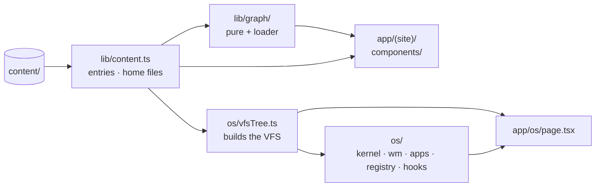
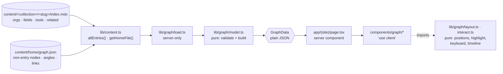

# The Graph Home — the site becomes a knowledge graph; the OS becomes a project

> **Status:** drafted 2026-09-27 · revised the same day after the reframe
> below · **approved 2026-09-27** · Phases 1 and 2 shipped 2026-09-27, Phase 3
> on 2026-09-28. Worked on
> `graph-home`, which was fast-forwarded into `main` after Phase 1; later
> phases commit to `main` directly.
>
> - [x] 0. Audit and plan
> - [x] 1. Separate the OS — moved into `os/`, docs split, draft tests on
>       fixtures, `personal-os` entry published (D-037, D-038)
> - [x] 2. Graph data layer — frontmatter fields, `graph.json`, `lib/graph/`,
>       validation, tests (D-039, D-040, D-041)
> - [x] 3. The graph on `/` — rings, highlighting, inspector, keyboard, the
>       `(reading)` route group (D-042, D-043, D-044)
> - [ ] 4. Timeline scrubber, and the listings below the graph
> - [ ] 5. Phone layout, reduced motion, accessibility pass
>
> **Design pass after Phase 3, 2026-09-28** (not in the plan; asked for after
> seeing it): the ring circles are no longer drawn, and the centre became a
> large amber disc with "MICHAEL" inside and a soft glow — the site's one
> accent, `--accent` in `globals.css` (D-045). The label-collision test now
> keeps every label off the disc and its glow.
>
> **Phase 3 deviations:**
>
> 1. **Marks stay in the SVG; the buttons carry an invisible hit square.** The
>    plan had the HTML layer "carry the labels"; it now also puts a 20px
>    transparent square over each mark, so the mark is clickable while the
>    drawing stays in SVG.
> 2. **A label-collision test** (`labelBox`, `overlaps`, in `load.test.ts`) was
>    not planned. Labels are fixed-size HTML over a drawing that scales, and a
>    screenshot at 1024px showed NanoGlide's label running into C++ — a clash
>    between rings that D-041's angular spacing cannot see. It checks every
>    year at full size and at 80%, and found a second clash (Gettysburg College
>    over Python). Four tool angles moved as a result: Python 75 → 88,
>    C++ 267 → 280, ROOT 290 → 292, Bun 0 → 4.
> 3. **Short labels.** `graph.json` entries take an optional `label`, because
>    two titles are too long for a ring: the demo-day talk shows as
>    "hq · AGC Demo Day" and the extension as "The Professor". Both are built
>    from words already in the content — the slug, and the extension's name —
>    and are yours to change. The full title stays in the inspector.
> 4. **`edgeBend`.** A fixed bend toward the centre hooked short edges between
>    neighbouring angles into loops; the bend now scales with how far apart
>    the ends are.
> 5. **`labelAnchor` became `labelSide`**, which also says above or below, and
>    `layout.ts` gained the drawing frame (`DESKTOP`, `nodePoint`).
> 6. **The writeup footers' `/os` links** in `components/entry.tsx` also got
>    `prefetch={false}` — they were pulling the whole OS on every writeup page.
>    Measured in a production build: the home page and a writeup now fetch
>    nothing from `/os`.
> 7. **The circle is not on the page's centre line** at wide sizes: the graph
>    and the inspector are centred together, so the circle sits left of centre.
>    Centring the circle alone would need an empty mirror column, which shrinks
>    the graph to about 460px at 1280 wide. Left as is; flagged.
> 8. **Moving routes left stale generated types** in `.next/dev/types/`, which
>    broke the build's type check until deleted. Documented in `running.md`.
>
> **Phase 2 deviations:**
>
> 1. **The placeholder-summary warning is a `prebuild` script**
>    (`scripts/warn-placeholder-summaries.mjs`), not code in `lib/content.ts`
>    as planned: `next build` renders in seven worker processes, and a warning
>    in the loader printed once per worker.
> 2. **"Fails the build" becomes true in Phase 3.** No route calls
>    `loadGraph()` yet, so until the home page renders the graph a bad
>    reference fails `pnpm test` (via `load.test.ts`), not `pnpm build`.
> 3. **Drafts are validated too.** The plan said references *to* drafts are
>    dropped; it did not say whether a draft's *own* references are checked.
>    They are, so a typo is caught while writing (D-040).
> 4. **`links` holds one pair**, Fermilab–CERN/CMS — the only relation between
>    non-entry nodes that is a plain fact. Organisations and fields connect
>    through entries instead.
> 5. **Organisation `href`s are their public homepages** (iris-hep.org,
>    fnal.gov, cms.cern, gettysburg.edu) — worth a glance. Tools have none.
> 6. **`MIN_SEPARATION` (24° / 18° / 10°) is provisional**, set before
>    anything is drawn. Phase 3 tunes it against the real rendering.
> 7. **`roundAngle` had a float bug**, caught by its own test: normalising
>    after rounding turned 12.3 into 12.300000000000011.
>
> **Phase 1 deviations:**
>
> 1. **No `createContentReader(dir)`.** It was built, and `pnpm build` then
>    warned that a directory passed as a parameter made Turbopack trace the
>    *whole project* into the server output. `lib/content.ts` keeps its
>    directory computed from `process.cwd()` at import; the fixture tests load
>    a fresh copy of the module with `cwd` pointed at `lib/__fixtures__/`.
>    Recorded in D-038.
> 2. **The fixture decision is D-038, not D-044** — the log is chronological.
>    The graph decisions below are renumbered **D-039 … D-044**.
> 3. **The OS may import `components/mdx`.** The plan said the OS imports
>    nothing from `components/`; in fact the viewer uses the site's prose
>    styling (D-018). The boundary test allows it by name, with `lib/content`,
>    `lib/memo` and the test-only fixture loader. The direction is still OS →
>    site only.
> 4. **`docs/running.md` was split rather than moved**: the OS's shell guide
>    went to `docs/os/running.md`, and a short site `running.md` replaces it.
> 5. **Link targets were retargeted repo-wide**, including in the append-only
>    decision log and old plans — the href only, never the wording. One link
>    was already broken before today (`plans/2026-08-12-content-pipeline.md`
>    → `app/page.tsx`) and is left as history.
> 6. **`review.md` is marked stale, not re-run.**
> 7. **The move shares one commit with the rest of Phase 1**, the
>    `personal-os` entry included, rather than going in alone. Its purity is
>    shown instead: all 67 moved files are byte-identical to their originals
>    once the `@/os/` import prefix and the `docs/os/gotchas.md` path are
>    normalised; 465 of 474 unit tests are unchanged (the other nine moved to
>    `os/vfsTree.test.ts` or onto fixtures); and all 148 browser checks pass
>    with identical check lists before and after. `git show -M` shows each
>    moved file as a rename.

> Read [../../AGENTS.md](../../AGENTS.md) and [../README.md](../README.md)
> first.

---

## The reframe

Recorded as given, 2026-09-27:

> The OS should be treated as some other project. Don't think of it as a
> portfolio OS for now — just some web OS I have built. It is part of the
> projects section; clicking its node boots the OS; we will work on its
> contents later. This is a drastic redesign: the OS is not removed, it is kept
> as a separate stale project for now. We build the graph front page and logic,
> finish it perfectly, then start working on the OS — I might have different
> ideas for it later. Perhaps the OS needs its own subfolder, with the graph at
> the top level.

What that changes in this plan:

- **The site is the graph.** The top level of the repo, the top-level docs and
  `AGENTS.md` describe the site. The OS is one project in it.
- **The OS is frozen, not deleted.** It moves into `os/` without any behaviour
  change. Its tests and verify scripts keep running, so it can't rot silently.
  Its docs move to `docs/os/` with a banner saying they are frozen.
- **The OS's design doc is not patched to fit the new framing.** It's the
  design record of a separate project, so it moves and gets frozen. The site
  gets its own design doc.
- **The OS node is a link.** Clicking it boots the OS, unlike every other node,
  where a click opens the inspector.
- **OS improvements wait.** Anything that would change OS behaviour goes on
  [the OS backlog](#os-backlog), not into this branch.

## Goal

`/` becomes an interactive knowledge graph of the work: me at the centre, then
three rings at fixed hand-set angles. Organisations and fields form the inner
ring, entries (projects, papers, talks) the middle ring, and tools and languages
the outer one. Hovering fades everything that isn't connected. Clicking opens
an inspector, and a timeline grows the graph year by year. The existing
listings stay underneath as the crawlable fallback.

The idea comes from bassamalim.web.app. That repository's licence allows reading
but not reuse, so nothing from it is copied: no code, no copy, no assets. See
[§ What was taken from the reference](#what-was-taken-from-the-reference).

---

## Target structure

```
app/
  (site)/                  the site
    layout.tsx             chrome: header + footer
    page.tsx               /  — the graph, listings below
    (reading)/             NEW route group: reading width
      layout.tsx
      about/ projects/ papers/ presentations/     (moved; URLs unchanged)
  os/page.tsx              /os — route only, imports from os/
  layout.tsx sitemap.ts robots.ts
components/
  entry.tsx mdx.tsx        unchanged
  graph/                   NEW — React only
lib/
  content.ts               entries + content/home files. No kernel import any more
  graph/                   NEW — pure graph logic + one server loader
  site.ts
os/                        NEW home of the OS — a separate, frozen project
  kernel/ wm/ apps/ registry/ hooks/     (moved as-is)
  OsShell.tsx              (moved from app/os/)
  vfsTree.ts               buildVFSTree, moved out of lib/content.ts
content/                   unchanged — the source of truth for both
docs/                      site docs (architecture, design, authoring, decisions, …)
  os/                      OS docs, frozen: design, architecture, gotchas, walkthrough, running
```

The dependency rule this sets up: **the OS reads the site's content, and the
site never imports the OS.**



No arrow leaves `os/` toward the site. A test enforces it (D-037).

**How far apart the two are today:** the site depends on the OS in exactly one
line, `lib/content.ts:17`, which imports `dir`/`file` from the kernel to build
the VFS tree. Everything else already points the other way. So the separation
is mostly moving files, and that one function moves to the OS side.

---

## Phase 0 findings

### Baseline on main (`516e366`)

| Check | Result |
|---|---|
| `pnpm lint` | clean |
| `pnpm build` | clean — 17 static pages, six entries prerendered as ● SSG |
| `pnpm test` | **472 / 474** — two failures in `lib/content.test.ts > drafts` |

The two failures come from content state, not code. `516e366` published all
six entries, and both tests assume at least one draft exists on disk. Fixed
permanently in Phase 1: see conflict 9.

### Conflicts and mismatches, with resolutions

| # | Problem | Resolution | Phase |
|---|---|---|---|
| 1 | authoring.md says any extra frontmatter field reaches `stat`. It doesn't: `stat` prints `node.meta` (`apps/terminal/commands/fs.ts:117`), but only six named fields go into `meta`, so `venue`/`location` never show | **Correct the doc** to say what's true: `cat` shows every field, `stat` only the named ones. Making all fields reach `stat` is an OS change → [OS backlog](#os-backlog) | 1 |
| 2 | D-036's "Revisit when" fires: `graph.json` is a second `content/home` file the web reads | Answered in D-039: data, not prose, and no frontmatter, so `getHomeFile` and `readEntry` stay separate. authoring.md gets a table of which `content/home` files each surface reads | 2 |
| 3 | The design doc describes the OS as the product | **Not patched.** It moves to `docs/os/design.md` with a frozen banner, since it's the design record of a separate project. The site gets a new `docs/design.md`, written as each graph phase ships. `AGENTS.md` stops pointing at the OS doc as "the design doc" | 1 |
| 4 | `app/(site)/layout.tsx` caps everything at `max-w-3xl` | A nested `(reading)` route group holds the cap; home is uncapped. [§ Escaping the width cap](#escaping-the-width-cap) | 3 |
| 5 | A draft `personal-os` entry would keep the OS node off the graph | Recommend **publishing** it (`draft: false`) with a placeholder summary, like the other six. The node's job is to boot the OS, and that works before the writeup exists. [Answer 2](#answered-2026-09-27) | 1 |
| 6 | All six published summaries say `DRAFT — replace this.` | Recommend a **non-fatal build warning** listing them; it becomes an error at launch. [Answer 3](#answered-2026-09-27) | 2 |
| 7 | Stale state: `docs/README.md` "Current state" says every entry is a draft; the 2026-09-01 plan says publishing was "deliberately not done"; memory said the same | README rewritten for the new framing; a dated note on the old plan; changelog. Memory already updated | 1 |
| 8 | vitest only runs tests under `kernel/ lib/ apps/ registry/ wm/`, not `components/` | Pure graph logic lives in `lib/graph/`; `components/graph/` is React only. A test forbids `node:*`, `react`, `lib/content` and `os/` imports in the pure modules. vitest's include becomes `lib/**`, `os/**` | 1–2 |
| 9 | The draft tests depend on whether real content happens to include a draft | **Pipeline tests run on fixture content**: `lib/content.ts` reads from a directory it's given, defaulting to `content/`; the draft-asymmetry tests use `lib/__fixtures__/content/` with one published and one draft entry. Tests *about* real content (slugs, colon-free titles, declared collections) stay on real content. Natural to do in Phase 1, since `content.ts` is being split anyway (D-038) | 1 |

### Other problems we will have to deal with

Found during the reframe audit. Where there's a decision for you, it's in
[Answered](#answered-2026-09-27).

1. **The OS has no way back to the site.** Nothing under `wm/`, `apps/` or
   `app/os/` links to `/`. From the graph, booting the OS is a one-way door;
   only the browser's back button returns. Fixing it is an OS change, so it's
   top of the [OS backlog](#os-backlog). Until then it's a known gap.
2. **`/os` prefetching.** `/os` is a static route. Per Next 16's `<Link>` docs,
   a link to a static route prefetches **the full route and its data** in
   production when it scrolls into view. For `/os` that data is the whole VFS
   tree: every entry's full text (D-011). The OS node will use
   `prefetch={false}`. Note that **the header's `/os` nav link, the footer link
   and the `boot →` button already cause this on every site page today.**
3. **Site chrome built around the OS.** The header name `personal-os`, the
   `/os` nav item, the `boot →` hero button, the footer line "built as an
   operating system", and the home paragraph "This site is a mock operating
   system". All five describe the old framing. Each gets a `PLACEHOLDER` comment
   in Phase 3 rather than a rewrite: the copy is yours. The nav item and the
   button are information-architecture calls as well as copy ([answer 5](#answered-2026-09-27): both dropped).
4. **`content/home/` is OS vocabulary.** It's the OS's `/home`, but the site now
   reads two files from it (`whoami.md`, `graph.json`). Two others,
   `about.md` and `readme.md`, describe the OS *as the portfolio*. Those two are
   OS-internal and stay untouched → OS backlog. The folder keeps its name,
   because renaming it moves OS paths.
5. **Moving code breaks paths in frozen history.** D-001 to D-036 and the old
   plans name `kernel/`, `wm/` and so on. The decision log is append-only, so
   those entries are **not edited**. A note at the top of `decisions.md` says
   paths before D-037 predate the move to `os/`. Code comments cite `D-NNN`
   ids, which don't move.
6. **`AGENTS.md` describes the old project.** "A portfolio built as a mock
   operating system", invariants written with `kernel/` paths, and "418 tests",
   which is stale. It's the instructions file, so the rewrite is shown below for
   your approval rather than slipped into a diff.
7. **The repo `README.md` is create-next-app boilerplate.** It gets a short,
   factual developer README (what's where, how to run and verify), and no bio.
8. **One design doc becomes two.** `docs/design.md` (the site) is new. The rule
   "patch the design doc, mark ▸ Built" applies to it from now on; the OS doc is
   frozen.
9. **The OS stays tested while frozen.** Its unit tests remain in `pnpm test`,
   and its six verify scripts still hit `/os` by URL. The move doesn't affect
   them, and running all six is the proof that Phase 1 changed nothing. They
   resolve Playwright from the npx cache and use system Chrome (D-009). If
   either is missing on this machine, I'll say so rather than skip them.
10. **A large diff.** Phase 1 renames 71 files: 67 of source and 4 docs. Git records them as
    renames (`git diff -M --stat`), and `git log --follow` keeps per-file
    history. It's still one commit that's tedious to review, so it goes in
    **alone**, with no behaviour change mixed in, and every check green before
    and after.
11. **The OS node behaves differently from every other node.** The rest select
    on click; this one leaves the page. Without a visible cue that's a
    surprise, and on a phone a tap boots immediately with no preview. So it
    gets a distinct mark and a hover/focus hint ("boot ↗"). The inspector is
    still reachable by choosing it from another node's connections, and it
    carries a "Launch the OS" button and the link to its project page.
12. **`/os` stays in the sitemap** at priority 0.8. It's a real route, so it
    stays, but it's now one project among many. Lowering it is a one-line call
    left for you.

---

## Design: the graph

### Data flow



It follows the `app/os/page.tsx` → `OsShell` pattern: the server reads the
disk, and the client receives plain data. The client imports only the pure
modules.

### New frontmatter fields

All optional, and all are lists of ids that **reference** nodes. They are not
free-form labels.

| Field | Values | Edge to | Example |
|---|---|---|---|
| `orgs` | ids of `kind: org` nodes in `graph.json` | inner ring | `orgs: [iris-hep]` |
| `fields` | ids of `kind: field` nodes | inner ring | `fields: [physics, cs]` |
| `tools` | ids of `kind: tool` nodes | outer ring | `tools: [python, redis]` |
| `related` | entry slugs, bare or `collection/slug` | middle ring | `related: [hq-agc-demo-day]` |

**Separate fields rather than one list** so the build can check the kind:
`orgs: [python]` is a mistake it can name.

**Relationship to `tags`.** Some tags duplicate these ids (`physics`,
`iris-hep`, `python`). They stay separate on purpose. `tags` is free-form, feeds
the shell's `tags` command, and a typo there does no harm. The new fields are
typed, and a typo fails the build. Deriving edges from tags would lose that
check and pull `talk`, `cli` and `hackathon` into the graph. Pruning the
duplicated tags is your call; nothing depends on it.

The new fields show in `cat` because they're in the file. They won't show in
`stat` until the OS backlog item lands. Titles stay colon-free.

### `content/home/graph.json`

This location works as you wanted. `buildHomeDir` already walks the directory
and inlines `.json` as `application/json`, so `cat /home/graph.json` and
`open /home/graph.json` work with no OS change.

```jsonc
{
  "nodes": [
    { "id": "iris-hep",   "kind": "org",   "label": "IRIS-HEP",           "angle": 30  },
    { "id": "cern-cms",   "kind": "org",   "label": "CERN / CMS",         "angle": 75  },
    { "id": "fermilab",   "kind": "org",   "label": "Fermilab / US-CMS",  "angle": 110 },
    { "id": "gettysburg", "kind": "org",   "label": "Gettysburg College", "angle": 200, "since": 2023 },
    { "id": "physics",    "kind": "field", "label": "Physics",            "angle": 150 },
    { "id": "cs",         "kind": "field", "label": "Computer science",   "angle": 250 },
    { "id": "math",       "kind": "field", "label": "Mathematics",        "angle": 290 },
    { "id": "quantum",    "kind": "field", "label": "Quantum",            "angle": 330 },
    { "id": "python",     "kind": "tool",  "label": "Python" }
  ],
  "links": [
    ["fermilab", "cern-cms"],
    ["cern-cms", "physics"]
  ],
  "entries": {
    "papers/hq":            { "angle": 45 },
    "projects/personal-os": { "angle": 260, "opens": { "href": "/os", "label": "Launch the OS" } }
  }
}
```

Angles and years are **illustrative**; the real values are set in Phase 2.

| Key | Meaning |
|---|---|
| `nodes[]` | every node that is not an entry. `id` kebab-case, unique; `kind` ∈ `org · field · tool` (kind decides ring); `label`; optional `angle`, `since`, `href`, `summary` |
| `angle` | degrees **clockwise from 12 o'clock**, like a clock face, so it can be set by eye |
| `since` | the year the node joins the timeline, where no entry dates it |
| `summary` | **left empty by me**: optional inspector prose, yours to write |
| `links[]` | edges between two non-entry nodes. Optional |
| `entries` | layout and behaviour for entries, keyed `collection/slug`: `angle`, and optional `opens` |
| `opens` | makes the node **a link** to `href` instead of a selector; `label` is the inspector's button. Used once, for the OS |

**Why angles aren't in frontmatter:** an angle is presentation, not a fact
about the work, and in frontmatter it would show up in `cat` beside the title.
With all layout in one file, the whole design is legible in one `cat`. **The
centre node isn't in the file**: its label is `SITE_NAME` and it links to
`/about`, so the name has no second copy to drift.

### Nodes, edges, rings

| Kind | Ring | From | Edges |
|---|---|---|---|
| `me` | centre | `SITE_NAME` | every inner-ring node, implicitly |
| `org`, `field` | inner | `graph.json` | me; entries referencing it; `links` |
| `entry` | middle | **published** entries | its `orgs`/`fields`/`tools`/`related` |
| `tool` | outer | `graph.json` | entries referencing it; `links` |

Edges are undirected and de-duplicated. Internal ids are namespaced
(`entry:papers/hq`, `tool:python`), so ids can't collide across kinds.

### Validation

Errors name the file, in `requireString`'s style:
`content/papers/hq/index.mdx: tools references unknown node 'redi'`.

| Situation | Result |
|---|---|
| unknown id in `orgs`/`fields`/`tools` | **fails** |
| right id, wrong kind (`orgs: [python]`) | **fails** |
| `related` names no entry on disk | **fails** |
| bare `related` slug matches two collections | **fails**, naming both |
| `related` names a **draft** | edge dropped: hidden, not broken |
| `graph.json` `entries` key names no entry on disk | **fails**, naming `content/home/graph.json` |
| … names a draft | ignored |
| duplicate id, unknown kind, angle outside 0–360, bad `opens.href`, malformed JSON | **fails** |
| a field that isn't a list of strings | **fails** |
| tool referenced only by drafts | hidden, so no dangling dots |
| inner-ring node with no entries | shown, since it connects to me |

`lib/graph/load.ts` runs during the home page's static render, so these fail
`pnpm build`. `load.test.ts` builds the real graph, so they fail `pnpm test`
too.

### Layout: fixed polar, no simulation

- A pure function from `(ring, angle)` to `(x, y)` in a fixed `viewBox`, with
  constant radii per ring. **Nothing moves on hover or on timeline changes**:
  nodes appear and disappear in place.
- **Every launch node gets a hand-set angle.** A deterministic fallback exists
  only so that publishing a new entry doesn't *require* editing `graph.json`:
  the circular mean of the node's inner-ring neighbours, else the middle of the
  widest empty arc on its ring. There's no physics step.
- **Legibility is a test.** No two visible nodes on a ring may sit closer than
  a minimum angle, in any timeline year. A fallback angle that lands on a
  neighbour fails `pnpm test`, and the fix is to hand-set it.
- Labels sit outside their node, on the side away from the centre. Edges are
  quadratic curves bending toward the centre, and spokes from me are straight.

### Timeline

| Node | Joins in |
|---|---|
| me | always |
| entry | the year of its `date` |
| org / field / tool | `since`, else the earliest connected published entry's year, else from the start |
| edge | when both ends are visible |

It's a native `<input type="range">` plus a Replay `<button>`. **Default is
the latest year**, the full graph, so the server-rendered HTML and the page with
JavaScript off both show everything. **The listings don't follow the
scrubber**, since the crawlable fallback must not depend on client state.

### Rendering, highlighting, inspector

The graph is two stacked layers sharing one pure coordinate function:

1. **An `aria-hidden` `<svg>`** for rings, edges and marks.
2. **An HTML layer of real `<button>`s**, and one `<a>` for the OS node,
   absolutely positioned by percentage. They carry labels, focus rings, hover
   and click. There's no `<button>` inside SVG, and orgs and tools *select*
   rather than navigate, so they need real buttons (D-042).

Behaviour:

- **Highlight** (hover *or* keyboard focus): the node, its direct neighbours
  and the edges from it to them stay at full strength; everything else goes to
  opacity `0.18`. Edges *between* two neighbours stay faded, which keeps the
  trace readable. The transition is 150ms, with none under reduced motion.
- **Click / Enter** selects, and the selection persists. The **OS node**
  navigates to `/os` instead, with `prefetch={false}` (problem 2) and a
  distinct mark plus a "boot ↗" hint (problem 11).
- **Inspector** (an `<aside>` beside the graph on desktop) shows: label,
  kind/collection, date, summary, tags, a link to `entry.href` (or the org's
  `href`), the `opens` button if any, and **connections grouped by kind, each a
  `<button>`** that selects that node. For me, it links to `/about`.

### Keyboard

The graph is **one tab stop**, using a roving `tabindex` (the ARIA
composite-widget pattern), so getting past the graph doesn't take thirty Tabs.

| Key | Does |
|---|---|
| `Tab` into the graph | focuses the selected node, else me |
| `←` / `→` | previous / next visible node on the ring, by angle, wrapping |
| `↑` / `↓` | out / in a ring, to the visible node nearest in angle |
| `Home` | back to me |
| `Enter` / `Space` | select; on the OS node, `Enter` follows the link |
| `Esc` | clear selection |

Nodes hidden by the timeline are skipped. Navigation is a pure,
unit-tested function in `interact.ts`.

### Phone (Phase 5)

A different layout, not the desktop one shrunk:

- The same angles on smaller radii. Labels show only for me, the inner ring
  and the selected node's neighbourhood.
- Tap selects, since there's no hover.
- The inspector is a **bottom sheet on a native `<dialog>`**, so Escape, focus
  containment and the backdrop come from the platform.

### Escaping the width cap

A nested `(reading)` route group. Next's `route-groups.md` names this exact use
("opting specific route segments into sharing a layout, while keeping others
out"). It's not a root layout, so navigating between pages doesn't trigger a
full reload.

- `app/(site)/layout.tsx` keeps only the header and footer, each in its own
  `mx-auto max-w-3xl` box, and leaves `<main>` uncapped.
- `(reading)/layout.tsx` applies `max-w-3xl` to `/about` and the three
  collections.
- Home sets its own widths: graph around `max-w-6xl`, listings back at
  `max-w-3xl`. Everything is centred, so the wider graph still lines up.

| Considered | Rejected because |
|---|---|
| CSS breakout (`w-screen` + negative margins) | `100vw` includes the scrollbar, which causes horizontal scroll on classic-scrollbar systems |
| `max-w-3xl` in each page | seven places that each have to remember it |
| Widen the whole site | reading pages at 72rem read worse |

---

## File-level plan

**Every phase** ends with `pnpm test`, `pnpm lint` and `pnpm build` green, plus
`pnpm verify:content` against `pnpm dev`. Docs go in the same commit.

### Phase 1: Separate the OS (behaviour-preserving)

**Needs your explicit OK:** it moves the directories the brief said not to
touch. File moves and import paths only; no logic changes.

| Change | Detail |
|---|---|
| `git mv kernel wm apps registry hooks os/` | |
| `git mv app/os/OsShell.tsx os/OsShell.tsx` | `app/os/page.tsx` stays as the route and imports from `@/os/…` |
| Import paths | `@/kernel` → `@/os/kernel` etc., in 37 files. The registry's `dynamic(() => import('@/os/apps/…'))` calls stay literal, so D-005 still holds. Plain text substitution; no logic touched |
| `os/vfsTree.ts` | **new**: `buildVFSTree`, `buildHomeDir`, `entryDirNode` and mime helpers move here from `lib/content.ts`, byte-for-byte. `lib/content.ts` loses its kernel import. VFS tests move with them |
| `lib/content.ts` | reads from a directory it's given, defaulting to `content/`; public API unchanged (D-038) |
| `lib/__fixtures__/content/` | **new**: one published entry and one draft; the draft tests run against it |
| `lib/boundary.test.ts` | **new**: nothing outside `os/` and `app/os/` imports `@/os`, and `os/` imports nothing from `components/` or `app/(site)` (D-037) |
| `vitest.config.mts` | include `lib/**`, `os/**` |
| `content/projects/personal-os/index.mdx` | **new**. `title: personal-os`; `summary: DRAFT — replace this. …`; `date: 2026-09-15` (last OS commit); a FACTS, NOT PROSE block from the repo and docs; one link to `/os`; published ([answer 2](#answered-2026-09-27)) |
| Code comments | `docs/gotchas.md` → `docs/os/gotchas.md` (9 references, all inside moved files) |
| Docs: `git mv` into `docs/os/` | `personal-os-portfolio.md` → `design.md`; `gotchas.md`; `walkthrough.md`; `running.md` |
| Docs: frozen banner | on every `docs/os/*` file: "A separate project, frozen 2026-09-27. Describes the OS as it was when frozen; not maintained until OS work resumes." |
| `docs/os/architecture.md` | **new**: OS sections of today's `architecture.md` (§ 1–5, 7–10), moved verbatim |
| `docs/architecture.md` | now the site: content pipeline (§ 6), routes, metadata, the boundary. The graph arrives in Phases 2–5 |
| `docs/design.md` | **new**: the site's design doc. Starts as intent (graph, rings, data model) with open items; sections gain **▸ Built** as phases ship |
| `docs/os/backlog.md` | **new**: [the OS backlog](#os-backlog) |
| `docs/decisions.md` | note on pre-move paths; D-037, D-038 |
| `docs/README.md` | map rewritten for site + `os/`; current state corrected |
| `docs/authoring.md` | the `stat` claim corrected; paths |
| `docs/plans/2026-09-01-launch-content.md` | dated note: step 4 done in `516e366` |
| `AGENTS.md` | the Project section and invariants, per [the proposal below](#proposed-agentsmd-changes) |
| `README.md` | short developer README replacing the boilerplate |
| Verification | before **and** after: all of `pnpm test`, the six `verify*` scripts against `pnpm dev`, and `pnpm build` — identical results, except the two draft tests now passing |

### Phase 2: Graph data layer

| File | Change |
|---|---|
| `content/home/graph.json` | **new**: nodes, links, entry angles, the OS `opens` |
| `content/*/*/index.mdx` (seven) | **frontmatter only**: `orgs`/`fields`/`tools`/`related` per the confirmed table. No prose touched |
| `lib/content.ts` | `Entry` gains `frontmatter` (normalised) and `sourcePath` for error messages; the `DRAFT` summary warning ([answer 3](#answered-2026-09-27)) |
| `lib/graph/model.ts` | **new**, pure: types, `buildGraph(spec, entries)`, all validation |
| `lib/graph/layout.ts` | **new**, pure: polar → xy, fallback angles, label side, edge path, separation |
| `lib/graph/interact.ts` | **new**, pure: `neighbours`, `highlight`, `visibleAt(year)`, `nextNode(key)` |
| `lib/graph/load.ts` | **new**, server: `getHomeFile('graph.json')` + published entries → `buildGraph` |
| `lib/graph/*.test.ts` | **new**: one fixture test per validation row; layout and interaction units; the real graph builds; separation holds in every year; the import-purity check |
| docs | `design.md` data model ▸ Built; `architecture.md` "The home graph" (data); `authoring.md` fields, `graph.json`, the table of which `content/home` files each surface reads; D-039, D-040, D-041; changelog |

### Phase 3: The graph on `/`

| File | Change |
|---|---|
| `app/(site)/(reading)/layout.tsx` | **new** |
| `app/(site)/{about,projects,papers,presentations}` | `git mv` into `(reading)/` |
| `app/(site)/layout.tsx` | width moves into the header and footer boxes; `PLACEHOLDER` comments (problem 3) |
| `app/(site)/page.tsx` | `loadGraph()` → `<KnowledgeGraph>`; listings below; `PLACEHOLDER` comments |
| `components/graph/KnowledgeGraph.tsx` | **new**, `'use client'`: hover and selection state |
| `components/graph/GraphCanvas.tsx` | **new**: the SVG layer |
| `components/graph/NodeLayer.tsx` | **new**: buttons, the OS link, roving tabindex |
| `components/graph/Inspector.tsx` | **new** |
| docs | D-042, D-043, D-044; `design.md` and `architecture.md` (rendering, routes); `authoring.md` paths; changelog |

### Phase 4: Timeline and listings

| File | Change |
|---|---|
| `components/graph/Timeline.tsx` | **new**: range input + Replay |
| `components/graph/KnowledgeGraph.tsx` | year state, filtered through `visibleAt` |
| `app/(site)/page.tsx` | listings settled under the graph via `EntryList`, server-rendered, independent of the scrubber |
| docs | `design.md`, `architecture.md`, changelog |

### Phase 5: Phone, motion, accessibility

| File | Change |
|---|---|
| `components/graph/*` | compact layout, `<dialog>` bottom sheet, `motion-reduce:` variants, `matchMedia` for Replay |
| `scripts/verify-graph.mjs` + `verify:graph` | **new**, with the same Playwright resolution as the others (D-009, no new dependency). Checks: highlight opacities, keyboard walk, zero movement on hover, the phone viewport opens a `<dialog>`, reduced motion, and a JS-off render that shows every node and listing |
| docs | `design.md` ▸ Built; `architecture.md` known gaps (the site now has a phone layout and keyboard support; the OS still has neither); `running.md`; changelog; fired `Revisit when` triggers answered |

---

## OS backlog

Deferred on purpose. The OS is frozen, and each of these changes its behaviour.
They go in `docs/os/backlog.md` in Phase 1.

- **An exit back to the site** (problem 1). Most urgent once the graph links in.
- **`meta` carries the whole frontmatter**, so `stat` shows `venue`,
  `location`, `orgs` and `tools` (conflict 1). About three lines in
  `os/vfsTree.ts`, plus a rule that frontmatter values stay flat, because
  `stat` prints an object as `[object Object]`.
- **`content/home/about.md` and `readme.md`** describe the OS as the portfolio
  (problem 4).
- **Everything already in the OS's known gaps**: mobile mode, accessibility,
  URL sync, the async read path (D-011).
- **Whether the OS keeps the name `personal-os`**, and what it's *for* now.
  You said you may have different ideas.

---

## Proposed decisions

Each is written into `decisions.md` in the phase that makes it true.

| ID | Decision | Cost |
|---|---|---|
| **D-037** | The OS is a separate, frozen project in `os/`. The OS reads `content/` through `lib/content.ts`; the site never imports the OS. A test enforces the direction | 71 renamed files; paths in D-001 … D-036 and old plans predate the move and aren't rewritten |
| **D-038** | Pipeline behaviour is tested on fixture content; tests on real content check only properties of real content | a second, tiny content tree to keep in step with the loader |
| **D-039** | The graph is derived from content: typed reference fields in frontmatter, plus `content/home/graph.json` for everything else. **Answers D-036's trigger** | `tags` and the new fields overlap visibly |
| **D-040** | Unknown references fail the build with the file path; references to drafts are dropped; only published entries are nodes | an edge can silently vanish when its target is unpublished — intended, but invisible |
| **D-041** | Fixed polar layout: ring by kind, hand-set angles, deterministic fallback, separation enforced by a test. No force simulation, no graph library | crowding is fixed by hand, never by the machine |
| **D-042** | The graph is an `aria-hidden` SVG under a layer of real HTML controls, with one tab stop and a roving tabindex; the phone inspector is a native `<dialog>` | two layers share one coordinate function, kept pure so they can't disagree |
| **D-043** | Reading width moves into a nested `(reading)` route group; home is uncapped | seven file moves; path references in docs |
| **D-044** | A node may `open` a URL instead of selecting. Used once, for the OS, with a distinct mark and a hint | one node breaks the "click inspects" rule; the mark is what makes that acceptable |

---

## Proposed `AGENTS.md` changes

The block Next writes at the top is untouched. Below it:

- **Project** becomes: a portfolio site whose front page is a knowledge graph
  of the work, built from `content/`. The repo also contains a web OS, a
  separate project in `os/`, frozen since 2026-09-27 and reachable at `/os`.
- **Invariants 1–3** keep their wording, but move under an "OS" heading with
  `os/` paths, and the stale "418 tests" line is dropped.
- **Two new site invariants:**
  - (4) nothing outside `os/` and `app/os/` imports the OS;
  - (5) `lib/graph/` layout and interaction logic is pure, with no DOM, no
    React and no `node:*`, and runs in bare node.
- **Docs pointers** name `docs/design.md` as the site's design doc and
  `docs/os/` as the frozen OS docs.

---

## Node assignments — confirmed 2026-09-27

Taken from the **Stack** lines in the FACTS blocks and the org mentions in each
writeup; confirmed as proposed, including the rows that were marked **?** as
guesses.

| Entry | `orgs` | `fields` | `tools` | `related` |
|---|---|---|---|---|
| papers/hq | iris-hep | physics, cs | typescript, bun, python, redis, grpc, dask? | hq-agc-demo-day |
| presentations/hq-agc-demo-day | iris-hep, gettysburg? | physics, cs | python, redis, dask | hq |
| papers/hscp-mass-reconstruction | fermilab, cern-cms | physics | root, python, numpy, scipy, matplotlib, jupyter | — |
| projects/academic-explainer | gettysburg? | cs | typescript, vscode?, gemini? | — |
| projects/treeviz | — | cs | python, textual?, rich? | — |
| projects/nanoglide | — | physics? | arduino, c++? | — |
| projects/personal-os | — | cs | typescript, react, nextjs | — |

- **Math** and **Quantum** wait until there is work to attach to them.
- **Gettysburg College** has `since: 2024`.

## Placeholders to flag, not rewrite

| Where | Says |
|---|---|
| `app/(site)/page.tsx` | "This site is a mock operating system. Everything below is also a real URL…" |
| `app/(site)/layout.tsx` header | `personal-os` as the site's name |
| `app/(site)/layout.tsx` footer | "built as an operating system — the shell is at /os" |
| `app/layout.tsx` comment | "the personal-os branding stays in the page chrome" |

Each gets a `PLACEHOLDER` comment saying what changed. `SITE_DESCRIPTION`
already has one. The `/os` nav item and the `boot →` button are removed, not
placeholdered ([answer 5](#answered-2026-09-27)).

## What was taken from the reference

Ideas only, from its README (the live site renders client-side and yielded
nothing more):

- rings with hand-set angles rather than a simulation
- hover-to-trace and a click inspector
- a timeline you can scrub or replay
- a phone bottom sheet on a native `<dialog>`

Not taken: its discipline filters, and all code, copy and styling.

## Not in scope

Any OS behaviour change (see the backlog), URL-synced selection, filters,
search, animating layout between years, and listings that follow the
timeline.

---

## Answered, 2026-09-27

1. **Separate the OS into `os/`:** yes. Done in Phase 1.
2. **Publish `personal-os` now:** yes — `draft: false`, placeholder summary.
3. **Placeholder summaries:** a non-fatal build warning listing published
   entries whose summary starts with `DRAFT`. Lands in Phase 2 with the loader
   changes; an error at launch.
4. **Node assignments:** confirmed as proposed, `?` rows included. Two
   follow-ups settled separately: **Math and Quantum wait** until entries exist
   (the inner ring starts with Physics and CS); **Gettysburg College** joins the
   timeline in **2024**.
5. **The `/os` nav item and the `boot →` button:** **dropped** in Phase 3. The OS
   is reached like any other project — its node and its page. That also removes
   two of the three site-wide `/os` prefetches (problem 2); the footer's line
   stays until you rewrite it, with a `PLACEHOLDER` comment.
6. **`personal-os`:** title `personal-os`; date **2026-09-15**, the last commit
   that touched OS code — not 2026-08-12.
