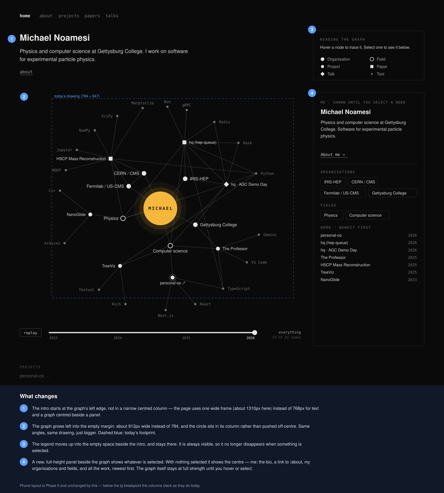

# Home layout — use the empty space around the graph

> **Status:** proposed 2026-09-28 as an annotated mockup, **approved the same
> day** with one addition (the default view of the centre lights up the graph),
> and **shipped 2026-09-28** (D-048). Between Phases 4 and 5 of the
> [graph-home plan](2026-09-27-graph-home.md); not one of its phases.

> Read [../../AGENTS.md](../../AGENTS.md) and [../README.md](../README.md)
> first.

## The ask

Given as an annotated screenshot: the page had wide empty margins on the left
of the graph and above the panel, while the graph and the text sat in narrower
centred columns. Use the gaps without cluttering:

- expand the graph into the empty area on its left;
- let the introduction span from the same left edge;
- move the legend ("Reading the graph") up into the space beside the
  introduction, and keep it;
- make a new box beside the graph that shows the selected node — and, with
  nothing selected, the centre: me.

## The mockup

Drawn from the real graph (node positions, edges and labels taken from the
server render) at 1440px wide. The blue pins and notes are annotations.

## What was built

| | Before | After |
|---|---|---|
| Frame | intro at `max-w-3xl`, graph and panel centred together at `max-w-6xl` | one `max-w-[82rem]` frame; intro, graph and listings start at its left edge |
| Header, footer | `max-w-3xl`, centred | the same wide frame on every page, so the name sits in one place |
| Graph at 1440px | 784px | 864px (832px at 1280, 648px at 1024) |
| Legend | the inspector's empty state | its own box beside the intro, always shown (`Legend.tsx`) |
| Inspector | legend, or the selected node | the selected node, or **me**: the intro, "About me", organisations, fields, and all the work newest first |
| Nothing selected | the graph at full strength | the graph traces the centre, as if it were hovered |

## Deviations from the mockup

1. **The panel is 18rem below `xl` (1280px), 22.5rem above.** At 1024px a
   22.5rem panel leaves the graph at 72% of its frame, below the 80% the
   label-collision test checks (D-042); 18rem leaves it at 81%.
2. **The centre's summary is the intro sentence**, from one constant,
   `SITE_INTRO` in `lib/site.ts`, which the page and the graph both read. It is
   still a `PLACEHOLDER`; rewriting it changes both.
3. **The work list uses the graph's short labels** ("hq · AGC Demo Day"), as
   the mockup did, not the full titles.
4. **The header and footer widened on every page**, not just the home page —
   the layout cannot tell which page it wraps, and a header that jumps between
   pages is worse than a reading column that sits centred under a wide header.
