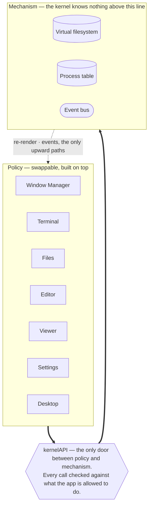
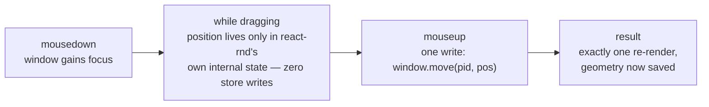

# Walkthrough: how this portfolio is built

A guided tour for someone who doesn't yet have the vocabulary — what each piece
is, why it exists, and the handful of decisions that shape everything else.
Companion to [architecture.md](architecture.md) (as-built detail),
[personal-os-portfolio.md](personal-os-portfolio.md) (the design intent), and
[decisions.md](decisions.md) (the reasoning log) — read those next for
anything this walkthrough simplifies.

---

## 1. The big idea

This isn't a portfolio site with some flair. It's a small, working operating
system simulation that runs entirely in the browser — and the portfolio
content (projects, papers) lives inside it as files.

Opening `/os` boots a desktop: a taskbar, draggable windows, a file manager, a
terminal you can type real commands into. Behind that desktop sits code doing
what a real OS's kernel does in miniature — it keeps track of a filesystem, a
table of running programs, and a way for those programs to signal each other —
except the "disk" is a JavaScript object tree and the "programs" are React
components.

The project is explicitly modeled on Unix philosophy: **mechanism, not
policy**. The core system provides raw capabilities (store a file, open a
window, send a message) but has no opinion about how anything should look or
behave. Every visible thing — the terminal's command set, the window manager,
each individual app — is built on top as a separate, swappable layer. The core
doesn't know what a "terminal" is; it only knows something asked to create a
process and read some bytes.



Why go to this trouble for a portfolio? Two reasons that show up constantly in
the rest of this document: it makes the system testable without a browser (a
filesystem made of plain objects can be tested in milliseconds), and it means
adding a new app is never a change to the core — "write a component, register
it," full stop.

---

## 2. Tech stack

**Framework, in one line.** A library gives you pieces you call when you need
them. A *framework* is more opinionated: it calls *your* code, at times and in
a structure it decides — routing, rendering, bundling. You build inside its
shape rather than assembling your own.

| Tool | What it is | Its job here |
|---|---|---|
| Next.js 16 | React framework | Routing, and — critically — the choice per-route of building HTML on the server ahead of time vs. running purely in the browser (more in §9). |
| React 19 | UI library | Breaks the interface into **components** — small, reusable functions that return markup — and re-renders only the ones whose data changed. |
| TypeScript | Typed JavaScript | JavaScript with type annotations checked before the code ever runs. In a project with a strict internal boundary (§4), a typo in a permission name becomes a red squiggle in the editor instead of a bug found in production. |
| Tailwind CSS 4 | Utility-first CSS | Styling by composing small, single-purpose classes (`flex`, `gap-2`, `text-sm`) directly in markup, instead of writing separate stylesheets. Version 4 configures itself from one line in CSS rather than a JS config file. |
| Zustand | State management library | Holds data that many components need to read or change — here, the filesystem and the table of open windows — outside any single component, so any part of the tree can subscribe to just the slice it cares about. |
| `@xterm/xterm` | Terminal emulator | Draws the actual terminal — cursor, scrollback, text rendering. The command logic underneath is hand-written and doesn't know xterm exists (§8). |
| `next-mdx-remote` | Markdown + JSX renderer | Turns the project/paper writeups (Markdown files with a bit of structure) into rendered pages. |
| `react-rnd` | Drag/resize library | Makes window frames draggable and resizable; see §7 for the one non-obvious rule around it. |
| Vitest | Test runner | Runs the automated test suite; used here in plain Node with no browser simulation (§10). |
| pnpm | Package manager | Installs and locks the exact version of every dependency, the same role npm or yarn play. |

**Build tool, briefly.** Browsers can't run TypeScript, JSX, or the newest
JavaScript syntax directly. A build tool (bundled inside Next.js here)
compiles all of that down into plain JavaScript the browser understands, and
packs the many source files into a small number of downloadable bundles — a
step called **bundling**.

---

## 3. Folder layout

Each top-level folder is one layer of the system. The names double as the
dependency rule: nothing below `kernel/` in this list is allowed to be
imported by it.

```
app/            # Next.js routes — the two entry points into the site
  (site)/       # crawlable pages: listings, /projects/[slug], /papers/[slug]
  os/           # the OS shell — one full-viewport client app
kernel/         # filesystem, process table, event bus, permissions. No React import, anywhere.
hooks/          # React bindings onto the kernel (subscriptions, selectors)
registry/       # appId → manifest map; how an app becomes launchable
wm/             # window manager: dragging, taskbar, desktop icons, snapping
apps/           # the seven apps themselves (terminal, files, editor, viewer, …)
lib/            # content.ts — reads project/paper files off disk at build time
content/        # the actual writeups, as Markdown files with metadata
components/     # shared presentational pieces (article layout, markdown styling)
scripts/        # verification scripts that drive a real browser
```

Two folders are worth a second look because their names describe a rule
rather than a topic. `kernel/` is plain TypeScript — it cannot import React at
all, which is what lets its tests run in a fraction of a second with no
browser involved. `hooks/` exists *because* of that rule: the kernel needed
React-facing bindings somewhere, and it couldn't be the kernel itself.

---

## 4. The kernel

Three plain-object stores, and one gate everything has to pass through to
reach them.

**State management, concretely.** "State" just means data that can change
while the app is running and that the interface needs to reflect — which
files exist, which windows are open. **Zustand** is the library holding that
data here, in three separate stores described below. Components "subscribe"
to a store and re-render automatically when the slice they asked for changes.

### Virtual filesystem (VFS)

A tree of nodes, each one a directory, a file, or an app shortcut. It's built
at build time from the real `content/` folder on disk, then lives in the
browser as an ordinary JavaScript object — `cd` and `ls` in the terminal are
just walking this tree.

It's writable, with one rule: **you can only remove what you added**. Files
created or edited during your session sit in an "overlay" on top of the base
tree; deleting one just removes it from the overlay rather than tracking a
tombstone. That's also why files survive a reload but an empty folder you
created does not — a folder is implied by the files inside it, so an empty
one leaves nothing in the overlay to remember it by.

### Process table

A flat list of every open window: which app, its position, size, and whether
it's normal, minimized, or maximized. Every window on screen is just this
list rendered — closing a window is deleting its row, nothing more
ceremonial than that.

### Event bus

A simple publish/subscribe channel: one part of the system announces
something happened, and anything listening reacts, with neither side needing
a reference to the other. Used sparingly — e.g. writing a file announces
`fs:changed` so any app displaying that file can refresh.

### The permission boundary

Apps never touch the three stores above directly. Every app gets a handle
built from one function — `kernelAPI` — and that handle only exposes the
specific operations its manifest declares:

```ts
fs.read(path)      fs.write(path, data)      fs.list(path)
proc.spawn(appId)  proc.kill(pid)            proc.focus(pid)
window.move(...)   window.resize(...)        window.setState(...)
events.emit(...)   events.on(...)
```

Every single call checks the caller's declared permissions first. The About
app, for instance, only ever gets `fs.read` — it physically cannot open a new
window or write a file, because the handle it was given doesn't have those
functions on it at all. This is the same idea as OS system calls (hence
"syscall boundary" in the project's own docs): a program doesn't reach into
the kernel's memory, it asks through a narrow, checked interface.

> **Why bother, with no other users on this system?** There's genuinely
> nothing to defend against today — it's one visitor's own browser tab. The
> boundary exists so that adding real isolation later (a plugin system, say)
> is a policy change to the permission checker, not a rewrite of every app.
> It's a real wall built before there's anything on the other side of it.

---

## 5. Apps & the registry

Seven apps, all wired up the identical way — which is the actual point of the
design.

An app is nothing more than a component plus an entry in
`registry/index.tsx` declaring its name, icon, permissions, and which file
types it can open. Adding a new one never touches the kernel:

| App | Can do | What it's for |
|---|---|---|
| `terminal` | read/write files, run processes | Boots by default; the command line described in §8. |
| `files` | read/write files, run processes | A graphical file browser — the third way of viewing the same tree, alongside the terminal and the desktop. |
| `editor` | read/write files | Plain text editing in place. |
| `viewer` | read files, spawn processes | Opens a file read-only — Markdown, images, PDFs, plain text — dispatched by the file's type. |
| `settings` | read/write files | Edits one file, `/home/.settings` — see below. |
| `about` | read files | A static bio page; also has a "crash this app" button to demonstrate that one broken app can't take down the session. |
| `sysinfo` | read files, listen to events | Shows live kernel state — also proves each app's code loads separately (next section). |

**Code splitting.** By default a web app can ship as one giant JavaScript
file, which means every visitor downloads the code for every feature whether
they use it or not. **Code splitting** breaks the bundle into pieces so a
piece only downloads when it's actually needed. Here, each app's component is
loaded with Next's `dynamic()` — opening the Editor is the moment its code is
fetched, not a moment before.

One real constraint surfaced building this: the import inside `dynamic()` has
to be written as a literal string per app (`import('@/apps/editor/Editor')`),
not built from a variable. The bundler matches import paths to downloadable
chunks at build time, and a computed path like
`import(\`@/apps/${appId}\`)` defeats that silently — it still runs, it just
quietly stops splitting the code at all.

Interesting restraint: `settings` "owns" nothing beyond writing one JSON
file. Wallpaper, accent color, icon size — the desktop and every other
surface just read that file directly and react to it changing. There's no
separate settings store to keep in sync; *writing the file is applying the
change.*

---

## 6. Window manager

The one piece of this codebase where getting it slightly wrong is very
visible: a laggy drag.

Every window is a single `Window` component rendering the process-table row
for that program, using **react-rnd** for drag and resize. The rule that
makes dragging feel instant is about exactly *when* a window's position gets
written to the shared process table.



Every mousemove during the drag touches nothing React manages. Committing on
every mousemove instead — an easy mistake — re-renders the window on every
pixel of movement.

The knock-on effect: the top-level `WindowManager` only watches the *list* of
open window IDs, not their positions, so it sits completely still through
every drag, resize, and focus change anywhere in the OS — only the one
window actually being moved re-renders. This rule is checked by an automated
script (`pnpm verify`) that drives a real browser and asserts zero state
commits happen mid-drag, not just claimed in a comment.

Minimizing a window doesn't unmount it — the component stays alive, just
hidden with `display: none`. That's a deliberate trade of a little memory for
a real feature: a terminal's scrollback and half-typed command survive being
minimized, because the component never actually went away.

---

## 7. The shell

A real, if small, Unix-like shell — pipes, redirection, tab completion,
history — built as logic that has never heard of a terminal.

The command logic (tokenizing a line, running a command, formatting output)
is plain TypeScript with no reference to xterm.js or the DOM anywhere in it.
xterm is treated as one possible *display* attached to that logic, not the
thing the logic is written against — which is what lets the whole command set
be tested by calling functions directly, with no browser in the loop at all.

Thirty-one commands are implemented, each with its own `man` entry. A few
highlights:

- **Pipes and redirection** — `grep -i physics / | wc > /home/count.txt`
  works as you'd expect: each command runs in turn, the previous command's
  output becomes the next one's input, and a trailing `>` or `>>` writes the
  final result to a file instead of printing it.
- **Tab completion** — reproduces the familiar "complete as far as possible,
  list options on a second tap" behavior.
- **Persisted history** — command history is stored as an actual file,
  `/home/.history`, inside the virtual filesystem rather than a separate
  mechanism. `cat /home/.history` just works, because it's a real file.

Deliberately absent: shell scripting features like `&&`, `$( )`, wildcards,
or variables. Each is a meaningful feature with its own edge cases, and the
project's own design notes call this exact territory "a scope-creep magnet"
— better to leave a clear gap than a half-implemented one.

---

## 8. The desktop

The icon-covered surface under the windows turns out to be the filesystem
itself, viewed differently.

There's no separate list of "which icons exist" anywhere. The desktop simply
renders whatever is inside the virtual folder `/desktop`. That single
decision makes a handful of things fall out for free:

- Running `cp readme.md /desktop` in the terminal makes an icon appear,
  instantly, with no extra code to keep the two in sync.
- Deleting the icon from the desktop and deleting the file from the terminal
  are the exact same operation underneath.
- Icon positions are themselves saved to a small file,
  `/desktop/.positions` — reusing the filesystem instead of inventing a new
  place to store layout.

Dragging an icon follows the identical rule as dragging a window (§6): the
position updates visually during the drag with no write to shared state, and
exactly one write lands when you let go.

---

## 9. Content pipeline & SEO

Two very different rendering strategies, used for two very different jobs,
from the same source files.

**Rendering strategies.** **Server-side generation (SSG)** builds a page's
full HTML once, ahead of time, when the site is deployed — a search engine or
a browser with JavaScript disabled sees complete content immediately.
**Client-side rendering (CSR)** ships a mostly-empty page plus JavaScript
that builds the interface in the visitor's browser after it loads —
necessary for something as interactive as a desktop full of draggable
windows, but invisible to a crawler that doesn't execute scripts.

The project deliberately uses both: `/projects/<slug>` and `/papers/<slug>`
are real, pre-built, crawlable pages (SSG) — so the writeups are discoverable
by search engines and readable with JavaScript off — while `/os` is a single
client-rendered app (CSR), because a desktop environment genuinely cannot
exist as static HTML.

Both are fed by the exact same read of a file on disk. Every project/paper
lives as a Markdown file with required front-matter (title, summary, date),
read once by `lib/content.ts`: the stripped body compiles into the public
page, and the raw file — front-matter included — becomes a file node in the
virtual filesystem, which is what makes `cat` on that same file inside the OS
show you exactly what's on disk. One read, two consumers, and they can never
quietly drift apart from each other.

Unfinished writeups are marked `draft: true` in their front-matter, which
removes them from the public listing pages and search-engine sitemap — but
leaves them fully browsable inside the OS, so in-progress work stays visible
to you without being visible to the internet.

---

## 10. Persistence

What survives a page reload, stored in your browser rather than any server.

The base content (every project and paper) ships baked into the app itself
and is never saved anywhere — it's already on disk, reloading it costs
nothing. What *does* get saved, to the browser's `localStorage`, is only the
difference from that baseline: files you created or edited, and which
windows were open and where. On reload, the shipped content loads fresh and
your changes replay on top of it.

Saved state carries a version number, checked against a small list of
upgrade steps. If a save was written by code from before a breaking change
and there's no upgrade path for it, the load quietly starts fresh instead of
crashing — a returning visitor should never see an error screen over stale
saved data.

---

## 11. Testing

Almost the entire system is tested without ever opening a real browser.

**Unit test, briefly.** A small, automated check: run one function with
known input, assert the output is what's expected. Run in bulk, these catch
a change that quietly breaks something elsewhere before a person ever
notices.

Because the kernel and the shell logic are plain TypeScript with no React or
DOM dependency, **Vitest** runs their tests directly in Node — no simulated
browser, no component rendering, which is why the project's own instructions
describe hundreds of tests (418, at last count) completing in well under a
second. That speed is a direct payoff of the "pass a message, don't hand out
a capability" rule from §4 and §8: the moment any of that logic needed a real
filesystem or a real DOM element to be tested, this would stop being true.

What plain unit tests can't check — does a drag actually avoid re-rendering,
does a page really render with JavaScript off — is covered by small scripts
in `scripts/` that drive an actual Chrome instance and assert on what
happens. Notably, **Playwright is deliberately not a dependency**
([D-009](decisions.md)): a handful of narrow, purpose-built scripts covers
what's needed without adopting a full testing framework for a handful of
checks.

---

## 12. Build & deploy

Nothing exotic — Next.js's standard path, on Vercel.

`pnpm build` compiles the SSG content routes to static HTML and bundles the
OS shell for the browser; `pnpm dev` runs both with hot-reload while
working. A small script mirrors non-text assets (PDFs, images) that live
beside a writeup into the public folder before either command runs, so a
project's own files ship without being manually copied anywhere. The target
platform is **Vercel**, which deploys a Next.js project with essentially no
configuration — a natural fit given the framework choice.

---

## 13. Decisions worth knowing

The project keeps a running decision log in [decisions.md](decisions.md). A
few that shape everything above:

- **[D-001](decisions.md)** — The kernel uses Zustand's "vanilla" store, not
  its React hook. This is *why* `kernel/` has zero React imports and its
  tests run in bare Node. React bindings were pushed out into `hooks/`
  instead.
- **[D-002](decisions.md) / [D-006](decisions.md)** — Window and
  process-table state updates only on gesture *end*, never mid-drag. This is
  the rule behind §6 — the single most performance-sensitive sequence in the
  app, and the one most likely to regress silently if someone "just" writes
  position on every mousemove.
- **[D-023](decisions.md)** — The shell asks the window manager to tile
  windows via an event, not a direct call. The terminal's `tile` command has
  no way to reach into the window manager and move a window itself — it
  announces intent on the event bus and the window manager, which actually
  knows the screen size, decides what to do.
- **[D-010](decisions.md)** — Content is read from disk exactly once,
  feeding both the public page and the OS's file. Prevents the two surfaces
  from ever showing subtly different text for the same writeup — a single
  source rather than two copies kept manually in sync.
- **[D-003](decisions.md)** — Saved state stores only the diff from the
  shipped content, not the whole tree. If the full site content were saved
  to every visitor's browser, publishing a content edit wouldn't reach
  anyone with an old save until they cleared it. Saving only the overlay
  keeps the two independent.

---

## 14. What's not built yet

Stated plainly, because the project's own docs do the same rather than
letting this drift into looking finished.

- All writeup content is currently marked draft, so the public listing pages
  show nothing yet.
- No mobile layout — this is a desktop-first, draggable-windows interface by
  nature.
- No accessibility work yet (screen reader support, keyboard navigation
  between windows).
- The browser's back button doesn't reflect which windows are open.

**▸ Built**, though, is everything described above it — kernel, permission
boundary, seven apps, the shell, the desktop, and persistence are real,
working code, not a plan. See [architecture.md § 10](architecture.md) for the
full, current list of gaps.

---

This project documents itself unusually well for its size —
[architecture.md](architecture.md) tracks exactly what the code does today,
[decisions.md](decisions.md) is an append-only log of the reasoning behind
each constraint, and [personal-os-portfolio.md](personal-os-portfolio.md) is
the original design intent, patched in place as things get built. All three
are worth reading directly once any of this is more than a passing
curiosity.
